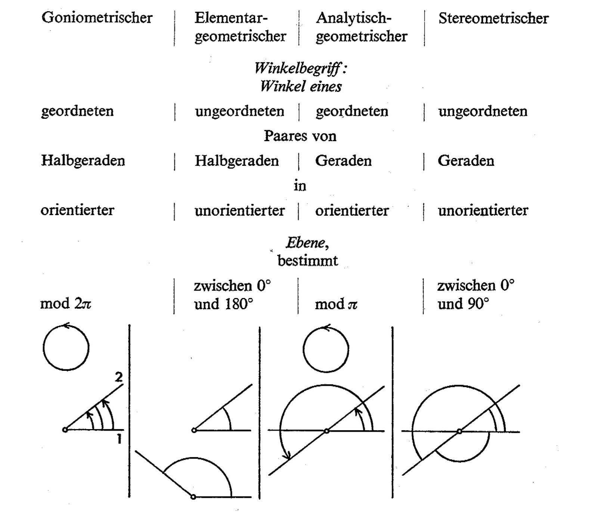
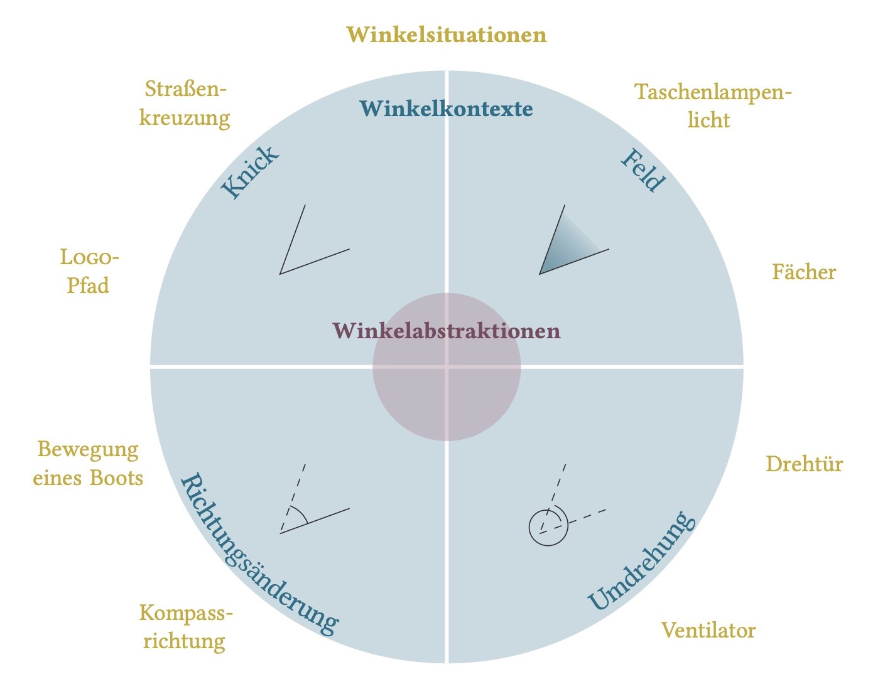

<!--
# (PART\*) Stoffdidaktische Analyse {.unnumbered}  
  
# Vier-Ebenen-Ansatz

> **Ziele**
>
> + Sie kennen typische Fragestellungen, um sich einer stoffdidaktischen Analyse systematisch zu nähern.
> + Sie erkennen den Vier-Ebenen-Ansatz als eine Möglichkeit, eine stoffdidaktische Analyse strukturiert vorzunehmen.
> + Sie können den Vier-Ebenen-Ansatz anhand eines Beispiels nachvollziehen.
> + Sie sind sich der Komplexität einer stoffdidaktischen Analyse bewusst.
>
> **Material**
>
> + Folien zum Kapitel 1 ([pdf](files/Stoffdidaktik2024-01-VierEbenenAnsatz.pdf), [Keynote](files/Stoffdidaktik2024-01-VierEbenenAnsatz.key))
> + [App *Winkel-Farm*](https://apps.apple.com/de/app/winkel-farm/id1369585218) (nur für iOS)

## Analyse von Lerngegenständen

Die inhaltliche Basis der ersten Kapitel dieses Skriptes bietet ein Beitrag von @Hussmann:2016 zur Spezifizierung und Strukturierung mathematischer Lerngegenstände. Dieser Beitrag schlägt eine Kategorisierung stoffdidaktischer Analysen vor und formuliert vielfältige Fragen, woraus sich wieder ein ganzes Repertoir an Themen ergibt, die es im Rahmen der Stoffdidaktik-Veranstaltung zu untersuchen gilt.

@Hussmann:2016 [{35 f.}]\index{4-Ebenen-Ansatz|see{Vier-Ebenen-Ansatz}} kategorisieren eine stoffdidaktische Analyse in eine **`r formal("formale")`**, **`r semantic("semantische")`**, **`r concrete("konkrete")`** und **`r empiric("empirische")`** Ebene, wobei diese nicht hierarchisch aufgebaut sind, sondern sich gegenseitig beeinflussen. Innerhalb der Ebenen wird jeweils noch einmal in die **Spezifizierung** und die **Strukturierung** eines Lerngegenstands unterschieden.

Auf der `r formal("formalen Ebene")`\index{Vier-Ebenen-Ansatz!formale Ebene|textbf} wird der Lerngegenstand aus seiner fachlich-logischen Struktur heraus betrachtet.

Die `r semantic("semantische Ebene")`\index{Vier-Ebenen-Ansatz!semantische Ebene|textbf} adressiert Sinn und Bedeutung des mathematischen Gegenstands sowie erkenntnistheoretische Aspekte.

Ziel der `r concrete("konkreten Ebene")`\index{Vier-Ebenen-Ansatz!konkrete Ebene|textbf} ist die Umsetzung des Lehr-Lern-Prozesses an konkreten Situationen, über die das mathematische Wissen konstruiert wird.

Über die `r empiric("empirische Ebene")`\index{Vier-Ebenen-Ansatz!empirische Ebene|textbf} werden die kognitiven und ggf. sozialen Aspekte der Schülerinnen und Schüler in die stoffdidaktische Analyse integriert.

Über die **Spezifizierung** wird ermittelt, *was* genau Schülerinnen und Schüler bezüglich eines bestimmten mathematischen Themas lernen sollen, während die **Strukturierung** analysiert, *wie* diese Elemente miteinander in Verbindung stehen und wie sie im Lernpfad strukturiert werden können.

Aus den vier Ebenen und der jeweiligen Unterscheidung in Spezifizierung und Strukturierung ergeben sich acht (nicht immer trennscharfe) Dimensionen, die den Analyseprozess zu einem Lerngegenstand kategorisieren können. Um dies für Forschungs- und Entwicklungsprozesse greifbar zu machen, haben @Hussmann:2016 [36] typische Fragestellungen formuliert, an die in Tabelle \@ref(tab:fragen-ebenen) mehr oder weniger stark angelehnt wird.

|   | Spezifizierung  | Strukturierung
|----|:----|:----
| **`r formal("Formale Ebene")`** | **Welche Begriffe, Zusammenhänge und Verfahren** sollen erarbeitet werden? <br/> Wie können die Zusammenhänge und Verfahren **formal begründet** werden? | Wie kann das **Netzwerk** aus Begriffen, Zusammenhängen und Verfahren **logisch strukturiert** werden? <br/> Welche **Verbindungen** zwischen den Fachinhalten sind aus fachlicher Perspektive entscheidend, welche weniger?
| **`r semantic("Semantische Ebene")`** | **Welche** (mathematisch-gesellschaftliche) **Bedeutung** liegt hinter dem Lerngegenstand (vgl. [*Fundamentale Ideen*](#fundamentale-ideen))? <br/> **Welcher Sinn** soll bei den Schülerinnen und Schülern hinsichtlich des Lerngegenstands aufgedeckt werden und **welche Repräsentationen** sind dafür geeignet (vgl. [*Grundvorstellungen*](#grundvorstellungen))? | Wie **verhalten** sich Sinn und Bedeutung des Lerngegenstands **zueinander** und **zu früheren und späteren Lerngegenständen**?
| **`r concrete("Konkrete Ebene")`** | **Welche [Kernfragen und Kernideen](#kernidee-begriffsklaerung)** können die Entwicklung der Begriffe, Zusammenhänge und Verfahren leiten? <br/> **Welche** (inner- und außermathematischen) **[Kontexte](#kontexte-begriffsklaerung)** sind geeignet, um an ihnen die Kernfragen und -ideen exemplarisch zu behandeln und die Inhalte zu rekonstruieren? | Wie kann das Verständnis sukzessive **über realitätsbezogene Situationen** in dem beabsichtigten Lernpfad konstruiert werden (vgl. [*horizontale Mathematisierung*](#mathematisierungstypen))? <br/> Wie kann der Lernpfad **in Bezug auf die mathematische Problemstruktur** angeordnet werden (vgl. [*vertikale Mathematisierung*](#mathematisierungstypen))?
| **`r empiric("Empirische Ebene")`** | **Welche** typischen **individuellen Voraussetzungen** (Vorstellungen, Kenntnisse, Kompetenzen, …) sind zu erwarten und **wie passen** diese zum **angestrebten Verständnis**? <br/> **Woher** kommen typische **Hindernisse** oder **unerwünschte Vorstellungen**? | Wie können typische **Vorkenntnisse und Vorstellungen** als **fruchtbare Anknüpfungspunkte** dienen? <br/> Welche **Schlüsselstellen** (Hindernisse, Wendepunkte, …) gibt es **im Lernweg** der Schülerinnen und Schüler?

Table: (\#tab:fragen-ebenen) Typische Fragestellungen, angelehnt an @Hussmann:2016 [36]


Diese Fragen können dabei helfen, einen Lerngegenstand aus professioneller Sicht vollumfänglich zu analysieren (insb. Spezifizierung) und daraus die Gestaltung eines Lernpfades für Schülerinnen und Schüler abzuleiten (insb. Strukturierung). Noch *nicht* abgeleitet werden kann daraus jedoch die Gestaltung einer *konkreten Unterrichtsstunde* -- dies bedarf weiterer Überlegungen, z. B. zu Unterrichtsmethoden, Aufgaben, Klassenmanagement, ... [@Hussmann:2016, 37].

## Lernbereich und Lerngegenstand

Als ***Lerngegenstände*** werden im Rahmen dieser Veranstaltung für spezifische Ausbildungszwecke ausgewählte Ausschnitte des gesellschaftlichen Wissens und Könnens angesehen [vgl. @Lompscher1985b]. Diese Sichtweise entstammt tätigkeitstheoretischen Überlegungen, wobei zwischen gesellschaftlichem Wissen und Können und individuellen Kenntnissen, Fähigkeiten und Fertigkeiten unterschieden wird. Weitere Hintergrundinformationen dazu finden Sie in späteren Kapiteln.<!--Abschnitt \@ref(aneignung-von-lerngegenstaenden) sowie in den Kapiteln \@ref(taetigkeitstheorie-und-lernen) und \@ref(lernhandlungen-ausbilden).-->

<!--
Zu Lerngegenständen gehören -- im Rahmen des Mathematikunterrichts -- sowohl **inhaltliche Themen** (wie der *Satz des Pythagoras*, *Rechnen mit negativen Zahlen*, …) als auch **typische Methoden und Vorgehensweisen** (wie das *Modellieren*, *Problemlösen*), aber auch **Werte und Normen**, die vermittelt werden sollen (z. B. dass in Rechnungen das *Gleichheitszeichen untereinander* geschrieben wird, handschriftliche Zeichnungen *mit einem gespitzen Bleistift anzufertigen* sind usw.). Auch innerhalb eines Themengebietes (z. B. dem Umgang mit Dezimalbrüchen) können Lerngegenstände beliebig kleinteilig beschreiben werden (etwa das Stellenwertverständnis, das Eintrag von Dezimalzahlen auf dem Zahlenstrahl usw.).

Um einer solchen Kleinteiligkeit entgegenwirken und zielgerichtete Analysen vornehmen zu können, wird sich im Rahmen der Stoffdidaktik-Veranstaltung auf inhaltliche Themen konzentriert, die zu ***Lernbereichen*** zusammengeführt werden. Üblicherweise spiegeln sich Lernbereiche in einer **Unterrichtssequenz** (oder auch in der Kapitelstruktur von Schulbüchern) wider [vgl. auch @Vollrath2012 187] und benötigen einen einigermaßen vergleichbaren Aufwand für die stoffdidaktische Analyse.


## Beispiel Winkelbegriff

Um sich der Komplexität des Vier-Ebenen-Ansatzes bewusst zu werden, sollen mögliche Gedankengänge am Beispiel des Winkelbegriffs\index{Winkel|(} durchgeführt werden. Grundlage hierfür bietet die Dissertation *Neue Zugänge zum Winkelbegriff* [@Etzold2021]. In dieser wird zwar nicht der Vier-Ebenen-Ansatz für die stoffdidaktische Analyse verfolgt, aber dennoch lassen sich die einzelnen Elemente darin wiederfinden. Ziel ist hier keine vollumfängliche stoffdidaktische Analyse, sondern eher eine Darstellung der exemplarischen Herangehensweise, wie man sich einer Spezifizierung und Strukturierung des Lerngegenstands *Winkel* auf den vier Ebenen nähern kann.

### Formale Ebene

Eine\index{Vier-Ebenen-Ansatz!formale Ebene|(} fachmathematische Analyse (bereits mit dem Blick auf eine schulische Nutzung) des Winkelbegriffs bieten u. a. @Freudenthal:1973, @Strehl:1983 oder @Mitchelmore:1990.

@Freudenthal:1973 [441] unterscheidet einen Winkel bspw. dahingehend, ob er über Geraden oder Halbgeraden (bzw. Strahlen) beschrieben wird, ob diese geordnet oder ungeordnet sind und ob sie in der orientierten oder unorientierten Ebene vorliegen (siehe Abbildung \@ref(fig:FreudenthalWinkel)).

(ref:citeFreudenthalWinkel) Winkelbegriffe nach @Freudenthal:1973 [441]

```{r FreudenthalWinkel, echo=FALSE, fig.cap="(ref:citeFreudenthalWinkel)", fig.align='center', out.width='75%'}

```

Er diskutiert, welchen Einfluss die jeweilige Sichtweise auf dem Maßbereich hat, wie Winkel überhaupt gemessen werden können und wie mit Winkeln operiert werden kann. Was passiert denn, wenn man ein  geordnetes Strahlenpaar in der orientierten Ebene spiegelt [vgl. @Freudenthal:1973 {443 ff.}]?

Wenn die Reihenfolge der Strahlen erhalten bleibt und die Winkelmessung aufgrund der Orientierung der Ebene vorgegeben ist, ändert sich damit ggf. auch das Maß des Winkels (siehe Abbildung \@ref(fig:FreudenthalWinkelSpiegeln)).

(ref:citeFreudenthalWinkelSpiegeln) Spiegelung eines goniometrischen Winkels [@Freudenthal:1973 {443}]

```{r FreudenthalWinkelSpiegeln, echo=FALSE, fig.cap="(ref:citeFreudenthalWinkelSpiegeln)", fig.align='center', out.width='50%'}
knitr::include_graphics("pictures/1-FreudenthalWinkelSpiegeln.jpg")
```

Hierzu stellt @Freudenthal:1973 [{443 ff.}] weitere fachmathematische Ausführungen dar und schließt damit, dass der elementargeometrische, goniometrische und analytische Winkelbegriff aus fachlicher Sicht für den schulischen Lernpfad unentbehrlich sind [@Freudenthal:1973 449].

Die *Spezifizierung* besteht also darin, den Begriff zu schärfen und Operationen mit ihm zu beschreiben. Die *Strukturierung* besteht u. a. in der vernetzenden Analyse der verschiedenen Winkelbegriffe und der Schlussfolgerung ihrer gleichermaßen Bedeutsamkeit für den Schulunterricht.\index{Vier-Ebenen-Ansatz!formale Ebene|)}

### Semantische Ebene

Dazu,\index{Vier-Ebenen-Ansatz!semantische Ebene|(} welche Vorstellungen Schülerinnen und Schüler zum Winkelbegriff entwickeln sollen, sei u. a. auf @Krainer:1989 und @Mitchelmore:1998 verwiesen. Eine grundsätzliche Schwierigkeit beim Unterrichten von Winkeln sind diverse und (scheinbar) nicht in Verbindung zu bringende Anwendungskontexte, die dennoch über denselben mathematischen Begriff beschrieben werden können. So ist das Sichtfeld eines Tieres ebenso wie die Umdrehung eines Wasserzählers über Winkel beschreibbar -- haben doch beide Situationen zunächst nichts miteinander zu tun.

Aufbauend auf den Arbeiten von @Krainer:1989 und @Mitchelmore:1998 können über eine Verknüpfung zur formalen Ebene mithilfe einer *informationstheoretischen Winkeldefinition* [@Etzold2021, {39 f..}] vier Grundvorstellungen zum Winkelbegriff ausgearbeitet bzw. validiert werden:

+ Winkel als Knick
+ Winkel als Feld
+ Winkel als Richtungsänderung
+ Winkel als Umdrehung

Dabei erhalten die *Bestandteile* eines Winkels (Scheitelpunkt, Schenkel, ggf. Bereich zwischen den Schenkeln, Abweichungsmaß) eine besondere Bedeutung, über die sich auch eine sinnvolle Reihenfolge der Behandlung dieser Grundvorstellungen ableiten lässt. So »bietet es sich an, mit den Winkelfeldern zu beginnen. Bei diesen werden die meisten Bestandteile sichtbar (Scheitelpunkt, beide Schenkel als Begrenzungen sowie der zwischen den Schenkeln relevante Bereich) […]. Anschließend können Knicke oder Richtungsänderungen behandelt werden, woraufhin die Umdrehungen folgen.« [@Etzold2021, 60]

Die *Spezifizierung* in diesem semantischen Teil ist demnach die Ausarbeitung der Grundvorstellungen. Die Begründung einer möglichen Reihenfolge kann der *Strukturierung* des Lerngegenstands zugeordnet werden.\index{Vier-Ebenen-Ansatz!semantische Ebene|)}


### Konkrete Ebene

Um\index{Vier-Ebenen-Ansatz!konkrete Ebene|(} die einzelnen Vorstellungen zu Winkeln aufzubauen, bedarf es charakteristischer Situationen, an denen der mathematische Kern der jeweiligen Vorstellung besonders gut sichtbar wird. Abbildung \@ref(fig:Winkelsituationen) zeigt derartige *Winkelsituationen* und die zugehörigen Grundvorstellungen (hier *Winkelkontexte*).


(ref:citeWinkelsituationen) Winkelsituationen und -kontexte [@Etzold2021, 70]

```{r Winkelsituationen, echo=FALSE, fig.cap="(ref:citeWinkelsituationen)", fig.align='center', out.width='75%'}

```

Exemplarisch für die Grundvorstellung des Winkels als Feld wird darauf aufbauend eine Lernumgebung und darin eingebettetes Unterrichtsmaterial entwickelt, mithilfe dessen die Grundvorstellung ausgebildet werden kann. An der konkreten Situation der *Sichtfelder von Tieren* sollen die Schülerinnen und Schüler Handlungen ausführen, die es ihnen ermöglicht, den mathematischen Kern hinter dem konkreten Beispiel zu erkunden.

Die Schülerinnen und Schüler nutzen dazu eine App (siehe Abbildung \@ref(fig:WinkelfarmApp)), in der mehrere Tiere mit ihren Sichtfeldern dargestellt werden können, und erhalten u. a. folgende Aufgaben [vgl. @Etzold:2019Praxis4 {8 ff.}]:

1. Setze das Schaf an eine Stelle, an der es von der Kuh gesehen wird, aber die Kuh selbst nicht sieht.
2. Setze das Schaf an eine Stelle, an der es nicht von der Kuh gesehen wird.
3. Das Schaf will die Kuh verwirren. Bewege es an möglichst viele Orte, an denen es von der Kuh gesehen wird.
4. Setze das Schaf an eine Stelle, an der es noch gerade so von der Kuh gesehen wird.
5. Wo muss das Schaf lang laufen, damit es die gesamte Zeit gerade so von der Kuh gesehen wird?

An Aufgabe 5 kann z. B. erkundet werde, dass sich das Schaf geradlinig auf der Grenze zwischen Sichtfeld und Nicht-Sichtfeld bewegen muss. In die eine Richtung ist die Bewegung beliebig fortsetzbar, in die andere durch den Kopf der Kuh begrenzt. Eine mathematische Verallgemeinerung dieser Handlung besteht dann in der Identifizierung des Schenkels (Begrenzung) als Strahl (nur in eine Richtung fortsetzbar) mit dem Scheitelpunkt (Kopf der Kuh) als *Quelle* des Winkelfeldes.

(ref:citeWinkelfarmApp) Screenshot der App Winkel-Farm [@Etzold:2019]

```{r WinkelfarmApp, echo=FALSE, fig.cap="(ref:citeWinkelfarmApp)", fig.align='center', out.width='75%'}
knitr::include_graphics("pictures/1-Winkelfarm.png")
```

Als *Spezifizierung* kann das Finden der Sichtfeld-Situation als charakterisches Beispiel für ein Winkelfeld angesehen werden. Die *Strukturierung* führt zum dargestellten Lernpfad und den konkreten Aufgabenstellung, über die konkrete Handlungen verallgemeinert werden und damit das mathematische Verständnis aufgebaut wird.\index{Vier-Ebenen-Ansatz!konkrete Ebene|(}


### Empirische Ebene

Die\index{Vier-Ebenen-Ansatz!empirische Ebene|(} zuvor beschriebene Lernumgebung wurde in mehreren Zyklen erprobt und dabei die Qualität der Handlungen der Schülerinnen und Schüler beobachtet. Ein Ziel bestand darin, dass möglichst verallgemeinerbare Handlungen (wie oben am Beispiel des Schenkels beschrieben) durchgeführt werden.

Es wird erwartet, dass die Repräsentation eines Sichtfeldes von der Draufsicht über eine semintransparent ausgemalte Teilfläche der Ebene noch nicht bekannt ist. Um diese nachzuvollziehen und mit eigenen Erfahrungen in Bezug zu bringen, wird an den Beginn der Unterrichtsstunde ein Bild des Klassenraumes in der Draufsicht präsentiert (siehe Abbildung \@ref(fig:Klassenraum)). Dann soll eine Schülerin oder ein Schüler beschreiben, was sie/er alles sieht, ohne den Kopf zu drehen. Dieser Bereich wird auf dem Bild eingezeichnet, so dass die Repräsentation des Sichtfeldes im Folgenden zur Verfügung steht.


```{r Klassenraum, echo=FALSE, fig.cap="Klassenraum von oben (Foto: Christian Dohrmann)", fig.align='center', out.width='75%'}
knitr::include_graphics("pictures/1-Klassenraum.png")
```

In der Erprobung konnte beobachtet werden, dass einige Bedienschwierigkeiten mit der Anwendung den Lernfortschritt hemmten. Dies konnte u. a. dadurch verbessert werden, dass vor die eigentliche Erarbeitung eine freie Erkundungsphase mit der App (siehe Abbildung \@ref(fig:WinkelfarmStart)) gesetzt wurde [@Etzold2021, 147,152]. Durch spezifische Aufgabenstellungen wurden bestimmte Funktionen der App fokussiert:


```{r WinkelfarmStart, echo=FALSE, fig.cap="Möglicher Startbildschirm für die freie Erkundungphase", fig.align='center', out.width='75%'}
knitr::include_graphics("pictures/1-WinkelfarmStart.png")
```

*»Das Pferd soll auf dem Steinpflaster stehen, die Frau soll auf dem Pferd sitzen/stehen. Das Pferd guckt in Richtung der grünen Büsche, die Frau hat die Augen zu. Gleichzeitig versteckt sich die Katze unter der Kuh.«*


Die Einführungsphase über das Klassenraumfoto folgt aus der *Spezifizierung* innerhalb der empirischen Ebene. Das Hinzufügen der freien Erkundungsphase ist dagegen der *Strukturierung* der Analyse zuzuordnen.\index{Winkel|)}\index{Vier-Ebenen-Ansatz!empirische Ebene|)}


### Verknüpfung der Ebenen

An den Ausführungen ist schon sichtbar geworden, dass sich die Ebenen nicht immer trennen lassen und teilweise gegenseitig beeinflussen. Auch gehen oft Spezifizierung und Strukturierung ineinander über.

Das ist aber gar nicht schlimm, ganz im Gegenteil. Es zeigt wieder einmal, wie wichtig solch ein ganzheitlicher Ansatz ist, so dass eine stoffdidaktische Analyse aus den diversen Sichtpunkten heraus betrachtet werden sollte.

Wichtig ist v. a., dass Sie sich als Lehrkraft stets darüber im Klaren sind, dass für eine stoffdidaktische Analyse verschiedene Perspektiven verfolgt werden müssen. Sehen Sie den Vier-Ebenen-Ansatz daher auch als Kontrollinstrument, ob Sie an alles gedacht haben, wenn Sie einen Lerngegenstand intensiv analysieren.


## Zum Nachbereiten {#vier-ebenen-nachbereitung}

1. Lesen Sie den Artikel von @Hussmann:2016 zum Vier-Ebenen-Ansatz.
2. Reflektieren Sie Ihre bisherige Fach- und Fachdidaktikausbildung in Mathematik dahingehend, welche der aufgeworfenen Fragen Sie zu konkreten Themenbereichen (nicht) beantworten könnten.

-->
