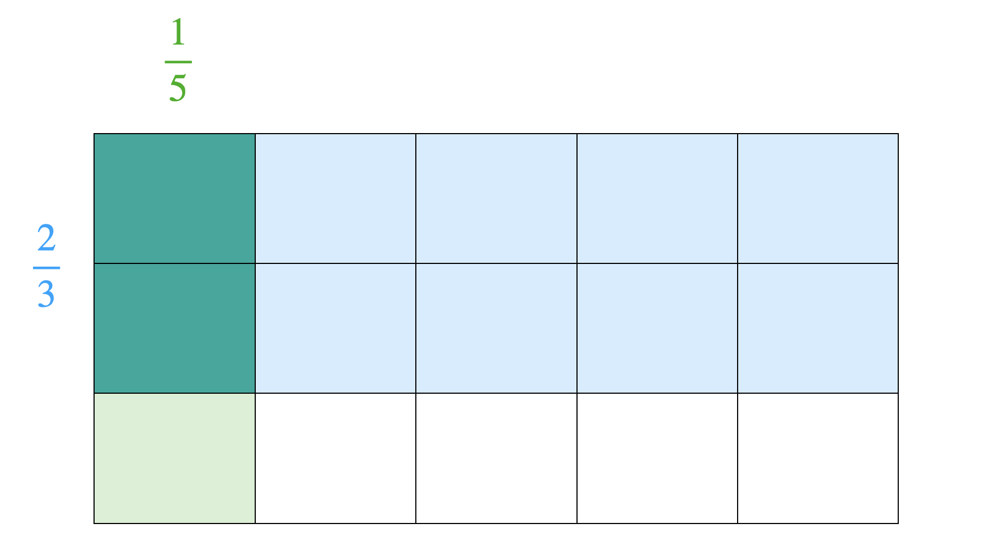

<!--
# Grundvorstellungen

> **Ziele**
>
> + Sie können die Grundvorstellungsidee beschreiben und wissen über deren Bedeutung für den Mathematikunterricht.
> + Sie kennen Grundvorstellungen zu einzelnen mathematischen Begriffen.
>
> **Material**
>
> + Folien zur Vorlesung zu Grundvorstellungen ([pdf](files/Stoffdidaktik-WiSe2223-Kap3.pdf), [Keynote](files/Stoffdidaktik-WiSe2223-Kap3.key))

## Begriffsklärung {#grundvorstellungen-begriffsklaerung}

### Grundvorstellungsidee

Als\index{Natürliche Zahlen|(} Sie zu Beginn Ihres Mathematikstudiums die Peano-Axiome zur Definition der Natürlichen Zahlen $\mathbb{N}$ kennengelernt haben, konnten Sie dies wahrscheinlich -- trotz der Neuigkeit der formalen Beschreibung -- derart mit Ihrer Lebenswelterfahrung in Verbindung bringen, dass Natürliche Zahlen abgezählt werden können, also dass damit z. B. die Platzierungen eines Wettrennens durchnummeriert werden können.

> **Peano-Axiome** [@WikiPeano]
>
> 1. $0$ ist eine natürliche Zahl.
> 2. Jede natürliche Zahl $n$ hat eine natürliche Zahl $n'$ als Nachfolger.
> 3. $0$ ist kein Nachfolger einer natürlichen Zahl.
> 4. Natürliche Zahlen mit gleichem Nachfolger sind gleich.
> 5. Enthält die Menge $X$ die $0$ und mit jeder natürlichen Zahl $n$ auch deren Nachfolger $n'$, so bilden die natürlichen Zahlen eine Teilmenge von $X$.

Dieser **Bezug auf eine bekannte Handlung** ist wesentlich dafür, dass die Definition und damit der Begriff der Natürlichen Zahlen für Sie mit einem Sinn behaftet ist. Innerhalb dieser *ordinalen Sichtweise* Natürlicher Zahlen helfen nun geeignete^[*Geeignet* heißt in diesem Fall, dass sich die Kernaussage des Begriffs in der Repräsentation wiederfindet. Im Ordinalzahlaspekt ist dies v. a. die Reihung von Zahlen. Was dabei (noch) nicht relevant ist, ist zum Beispiel die exakte Messbarkeit, wie man sie etwa auf dem Zahlenstrahl repräsentiert.] **Repräsentationen** dabei, sich Rechenoperationen vorstellen und sie **operativ**^[*Operativ* heißt hier zum Beispiel, dass Sie zu einer Aufgabe wie $2+7$ Nachbaraufgaben ($2+8$), Umkehraufgaben ($7-2$), Platzhalteraufgaben ($2+\boxed{\phantom{5}}=7$) usw. aufstellen und lösen können.] auszuführen zu können, also bspw. das Addieren als ein Weiterzählen aufzufassen (siehe Abbildung \@ref(fig:Addition)).\index{Natürliche Zahlen|)}

```{r Addition, echo=FALSE, fig.cap="Additionsaufgabe im ordinalen Zahlaspekt", fig.align='center', out.width='75%'}
knitr::include_graphics("pictures/3-Addition.png")
```

Mit der Fähigkeit der Verknüpfung des mathematischen Begriffs und der Lebenswelt ist also eine **Anwendung des Begriffs auf die Wirklichkeit** möglich, insbesondere in Modellierungsprozessen. Dabei sind beide Richtungen relevant: Von der Realsituation zur Mathematik und von der Mathematik zur Realität.

Ziel des Mathematikunterrichts sollte es nun sein, für alle relevanten mathematischen Begriffe ein derartiges Verständnis aufzubauen, was auch heißt, verschiedene Vorstellungen zu einem Begriff zu vermitteln. Nach @Hofe:1995 [{97 f.}, Hervorhebung durch H.E.] ergibt sich daraus eine Orientierung an Grundvorstellungen im Mathematikunterricht:

::: {.definition #Grundvorstellungen name="Grundvorstellungen"}
Die **Grundvorstellungsidee**\index{Grundvorstellung|textbf}\index{Grundvorstellungsidee|see{Grundvorstellung}} beschreibt **Beziehungen zwischen mathematischen Inhalten und** dem Phänomen der **individuellen Begriffsbildung**. In ihren unterschiedlichen Ausprägungen charakterisiert sie mit jeweils unterschiedlichen Schwerpunkten insbesondere drei Aspekte dieses Phänomens:

- Sinnkonstituierung eines Begriffs durch **Anknüpfung an** bekannte **Sach- oder Handlungszusammenhänge** bzw. **Handlungsvorstellungen**,\index{Grundvorstellung!Sinnkonstituierung|textbf}
- Aufbau entsprechender (visueller) **Repräsentationen bzw. »Verinnerlichungen«**, die **operatives Handeln** auf der Vorstellungsebene ermöglichen,\index{Grundvorstellung!Repräsentation|textbf}
- Fähigkeit zur Anwendung eines Begriffs auf die Wirklichkeit durch **Erkennen der** entsprechenden **Struktur in Sachzusammenhängen** oder durch **Modellieren** des Sachproblems **mit Hilfe der mathematischen Struktur**.\index{Grundvorstellung!Modellierung|textbf}
:::

### Ausdifferenzierung

Weiterhin unterscheidet @vomHofe2014 zwischen **primären**\index{Grundvorstellung!primäre Grundvorstellung} und **sekundären**\index{Grundvorstellung!sekundäre Grundvorstellung} Grundvorstellungen, abhängig von der Erfahrungswelt der Handlungen. Während sich primäre Grundvorstellungen auf reale Handlungserfahrungen stützen (z. B. mit Steckwürfeln in der Arithmetik), entstammen sekundäre Grundvorstellungen aus den Handlungen mit bereits im Mathematikunterricht aufgebauten Repräsentationen (z. B. Operationen auf dem Zahlenstrahl).


Ich als Autor dieses Dokuments vertrete die Ansicht, dass Grundvorstellungen zu **Aspekten** eines Begriffs und zu **Operationen** mit diesen Begriffsaspekten formuliert werden können. So wäre das oben angebrachte Beispiel der ordinalen Anordnung der Natürlichen Zahlen ein *Begriffsaspekt* mit der damit verbunden Grundvorstellung, dass die Natürlichen Zahlen eine feste Reihenfolge darstellen, beginnend bei $0$. Das *Addieren* ist eine Operation in diesem Aspekt, verbunden mit der Grundvorstellung des Weiterzählens. Eine ähnliche Unterscheidung, jedoch mit inhaltlich anderer Ausrichtung, nehmen auch @Greefrath2016 [17] vor. Eine Diskussion dazu findet sich bei @Etzold2021 [{72 f.}]. Die genannten Begriffs*aspekte* sind jedoch nicht mit den *Aspekten* der Grundvorstellungsidee in Definition \@ref(def:Grundvorstellungen) zu verwechseln.
Auch wenn Sie nicht unmittelbar und sofort jeweils alle Aspekte eine Begriffs im Unterricht ansprechen werden, hilft Ihnen das Wissen über den Aspektreichtum in der Unterrichtsplanung für die Ausbildung eines umfassenden Begriffsverständnisses.

Die in Definition \@ref(def:Grundvorstellungen) dargestellte Grundvorstellungsidee hat einen **normativen**\index{Grundvorstellung!normativ|textbf} Charakter, d. h. es wird davon ausgegangen, dass (aus professioneller Sicht der Mathematikdidaktik) zu mathematischen Begriffen bestimmte Grundvorstellungen identifiziert werden können, die es im Unterricht zu vermitteln gilt. Oder anders gefragt: »Welche Grundvorstellungen sind zur Lösung des Problems aus der Sicht des Lehrenden adäquat?« [@Hofe:1995 106]. Diese Sichtweise wird durch eine **deskriptive**\index{Grundvorstellung!deskriptiv|textbf} Perspektive ergänzt: »Welche individuellen Vorstellungen lassen sich im Lösungsversuch des Schülers erkennen?« [@Hofe:1995 107]. Diese über empirische Untersuchungen zu ermittelnden Vorstellungen sind das, was sich Schülerinnen und Schüler *tatsächlich* unter einem Begriff vorstellen, wozu ggf. auch typische *Fehlvorstellungen*^[Mit *Fehlvorstellungen* sind hier individuelle Vorstellungen der Schülerinnen und Schüler gemeint, die mathematisch nicht tragfähig und daher aus fachlicher Perspektive fehlerhaft sind. So ist etwa die Vorstellung, dass Multiplizieren vervielfacht, in den Natürlichen Zahlen tragfähig (und damit eine Grundvorstellung), in den Bruchzahlen jedoch nicht mehr tragfähig und wird dort dann zur Fehlvorstellung. Neben *Fehlvorstellungen* können weitere individuelle Vorstellungen *Alltagsvorstellungen*, *Präkonzepte* o. ä. sein [siehe auch @Schecker2018 {11 f.}].] gehören können. Ein Wissen darüber ist für Lehrkräfte ungemein wichtig, um Ergebnisse von Schülerinnen und Schülern interpretieren und einordnen zu können und dann ggf. entsprechende Hilfsangebote zu machen. Dies entspricht dann einer **konstruktiven**\index{Grundvorstellung!konstruktiv|textbf} Perspektive auf Grundvorstellungen: »Worauf sind etwaige Divergenzen zurückzuführen, und wie lassen sich diese beheben?« [@Hofe:1995 107].


## GV und Stoffdidaktik

Im Rahmen dieser Veranstaltung, insbesondere den von Ihnen ausgearbeiteten Seminarthemen, wird der Schwerpunkt auf *normative* Grundvorstellungen gelegt, was der `r semantic("semantischen Ebene")` des [Vier-Ebenen-Ansatzes](#tab:fragen-ebenen) zugeordnet werden kann, weil die mathematischen Begriffe hier mit einem Sinn versehen werden. Die *deskriptive* und *konstruktive* Perspektive sind dagegen der  `r empiric("empirischen Ebene")` zuzuordnen, da hier individuelle Vorstellungen der Schülerinnen und Schüler von Relevanz sind. Dies betrifft insbesondere auch das Potenzial, (ggf. mathematisch unvollständige) individuelle Vorstellungen aufzugreifen bei der Ausbildung von (normativ erwünschten) Grundvorstellungen.

Das Identifizieren von Grundvorstellungen zu einem Begriff ist, genau wie bei den [Fundamentalen Ideen](#fundamentale-ideen), Aufgabe der mathematikdidaktischen Forschung [ein Modell dafür findet man bei @Salle2021]. Als Lehrkraft profitieren Sie von diesen Ergebnissen und nutzen sie für Ihre stoffdidaktische Analyse.

Im Gegensatz zu den Fundamentalen Ideen, die ihren Ursprung in der Sachstruktur des mathematischen Inhalts haben, entstammen die Grundvorstellungen stärker der *Bedeutung* der fachlichen Begriffe *für das Individuum*. Grundvorstellungen beziehen sich auf spezifische Begriffe und Operationen mit Begriffen, während Fundamentale Ideen größere, themenübergreifende Leitlinien für die Stoffauswahl und -strukturierung bilden.

Für die Unterrichtsplanung und -durchführung ist neben der Frage, *welche* Grundvorstellungen von Relevanz sind (Spezifizieren im Vier-Ebenen-Ansatz) vor allem interessant, *wie* diese ausgebildet werden können (Strukturieren im Vier-Ebenen-Ansatz).

@Hofe:1995 [{123 ff.}] schlägt hierzu vor, zunächst aus Lehrkräftesicht den Lerngegenstand von der Mathematik her zu analysieren, Grundvorstellungen zu identifizieren, geeignete Sachzusammenhänge zu finden und diese mit den Erfahrungsbereichen der Schülerinnen und Schüler zu verknüpfen (linke Seite in Abbildung \@ref(fig:GVausbilden)), während die Schülerinnen und Schüler dann den umgekehrten Weg zum Begriffserwerb gehen (rechte Seite in Abbildung \@ref(fig:GVausbilden)).\index{Grundvorstellung!Aufbau von}

(ref:citeGVausbilden) Ausbilden von Grundvorstellungen [@Hofe:1995 124]

```{r GVausbilden, echo=FALSE, fig.cap="(ref:citeGVausbilden)", fig.align='center', out.width='50%'}
knitr::include_graphics("pictures/3-GVausbilden.png")
```

Konkreter wird es an dieser Stelle jedoch noch nicht. Im Rahmen dieser Veranstaltung wird die Gestaltung von Lernprozessen in den Kapiteln \@ref(lerntaetigkeit-und-lernhandlungen) bis \@ref(aufgabengestaltung) in den Blick genommen, wo die Ausbildung von Grundvorstellungen noch einmal eine Rolle spielen wird.

## Beispiele

### Natürliche Zahlen
Betrachten Sie folgenden (fiktiven) Zeitungsartikel:\index{Natürliche Zahlen|(}

> ***Harlequin erneut auf dem 1. Platz***
>
> *Bei dem traditionellen Pferderennen am 15. Mai hat das Pferd Harlequin erneut gewonnen. Unter den 10 Pferden, die an den Start gingen, belegte es mit 21,3 Sekunden den 1. Platz. Damit war es fast 2 mal so schnell unterwegs wie das letzte Pferd, das ins Ziel kam. Karten für das nächste Rennen können unter 030 23125143 bestellt werden.*

In dem Text tauchen Zahlen unter vielen Aspekten auf: Der **1.** Platz und **15.** Mai sind **Ordinalzahlen**, also Zahlen, die eine Ordnung beschreiben. Wie oben schon beschrieben, lassen diese sich fachmathematisch über die Peano-Axiome beschreiben und wenn mit ihnen gerechnet, entspricht z. B. das Addieren dem **Weiterzählen**.

Die **10** Pferde stellen eine **Kardinalzahl** dar, also die Anzahl der Elemente einer Menge. Addiert man Kardinalzahlen, so müssen **Mengen vereinigt** werden, z. B. anschaulich, indem man sie zusammen legt.

Die **21,3** Sekunden entsprechen einer **Maßzahl**, da diese Zahl die Funktion hat, etwas auszumessen (hier die Zeit). Das Addieren in diesem Aspekt entspräche dem **Aneinanderlegen**, z. B. wenn zwei Längenangaben addiert werden.

Dass es **2** mal so schnell wird, enspricht einem **Operatoraspekt**, mit dem die Vielfachheit eines Vorganges beschrieben wird. Das Addieren ist hierin eine **Hinereinanderausführung** eines Vorganges.

Die Telefonnumer **030 23125143** wiederum erfüllt einen **Codierungsaspekt**. Sie hat im mathematischen Sinne keine Bedeutung, nur die Anordnung der Ziffern ist von Relevanz. Entsprechend kann innerhalb dieses Aspektes auch nicht addiert werden. Weitere Beispiele hierfür wären Postleitzahlen oder Identifikationsnummern.

Hinzu kommt noch der Aspekt der **Rechenzahl**. Informationen dazu sowie eine genauere Erläuterung der Zahlaspekte und damit verbundenen Operationen findet man z. B. bei @Krauthausen:2018 [{43 ff.}].\index{Natürliche Zahlen|)}


### Bruchzahlen


Nachdem\index{Brüche|(} die Schülerinnen und Schüler ihr gesamte Vorschul- und Primarstufenzeit mit Natürlichen Zahlen verbracht haben, treten mit der Einführung von Bruchzahlen Umbrüche in den subjektiven Vorstellungen auf. Zum Beispiel sind folgende (vermeintlichen) Gesetzmäßigkeiten plötzlich *nicht mehr* gültig:

* Das Produkt zweier Zahlen ist größer als die jeweiligen Faktoren.
* Die Multiplikation kann als wiederholte Addition aufgefasst werden.
* Jede Zahl hat genau einen Repräsentanten.
* Je mehr Stellen eine Zahl hat, desto größer ist sie.

Die Bruchzahlen selbst besitzen nach @Padberg:2017 [{19 ff.}] folgende Aspekte:

* Bruch als **Anteil eines Ganzen** oder **mehrerer Ganzer**
  (z. B. $\frac{2}{3}$ als zwei Drittel einer Pizza oder je ein Drittel von zwei Pizzen),
* Bruch als **Maßzahl**
  (z. B. $\frac{1}{4}$ Liter),
* Bruch als **Operator**
  (z. B. $\frac{1}{5}$ von 250 €),
* Bruch als **Verhältnis**
  (z. B. $\frac{2}{3}$ mit der Bedeutung *2 von 3 Schüler/-innen tragen eine Brille*),
* Bruch als **Quotient**
  (z. B. $\frac{3}{5}$ als Ergebnis bzw. andere Schreibweise von $3:5$),
* Bruch als **Lösung einer linearen Gleichung**
  (z. B. $\frac{3}{5}$ als Lösung von $5x = 3$),
* Bruch als **Skalenwert**
  (z. B. $\frac{3}{2}$ als Mitte zwischen $1$ und $2$ auf dem Zahlenstrahl),
* **Quasikardinale Auffassung** von Brüchen
  (z. B. $\frac{3}{5}$ als 3 mal $\frac{1}{5}$).

Neben den Grundrechenoperationen führt auch das Vergleichen von Brüchen zu Grundvorstellungsumbrüchen. Hinzu kommen noch besondere Operationen mit Bruchzahlen wie das Erweitern und Kürzen.

Das Multiplizieren von Brüchen kann bspw. als Anteilsbildung ($\frac{1}{5}$ mal … heißt $\frac{1}{5}$ *von* …) oder als Rechteckfläche aufgefasst werden [@Padberg:2017 {108 ff}], siehe Abbildung \@ref(fig:Bruchmultiplikation).


```{r Bruchmultiplikation, echo=FALSE, fig.cap="Vorstellung von $\\frac{1}{5} \\cdot \\frac{2}{3}$ als Rechteckfläche", fig.align='center', out.width='50%'}

```


All dies zeigt, dass Brüche behutsam unterrichtet werden sollten und von einer rein kalkülorientierten Behandlung unbedingt abgesehen werden muss, da diese den nachhaltigen Lernerfolg deutlich mindert.\index{Brüche|)}


## Zum Nachbereiten {#grundvorstellungen-nachbereitung}

1. Lesen Sie (mindestens) die Kapitel 1.11.2, 1.11.4., 2.1, 2.2 und 2.4 des Buches *Grundvorstellungen mathematischer Inhalte* [@Hofe:1995].
2. Wählen Sie eine Grundvorstellung zu einem mathematischen Begriff aus und arbeiten Sie an dieser die Grundvorstellungsidee nach Definition \@ref(def:Grundvorstellungen) durch, d. h.
   - stellen Sie die Sinnhaftigkeit des Begriffs durch mögliche Handlungserfahrungen dar,
   - finden Sie geeignete Repräsentationen, anhand derer operatives Handeln ermöglicht wird und
   - beschreiben Sie mögliche Modellierungsprozesse des Begriffs mithilfe der gewählten Grundvorstellung.
3. Wiederholen Sie Aufgabe 2 an weiteren Begriffen.

-->
