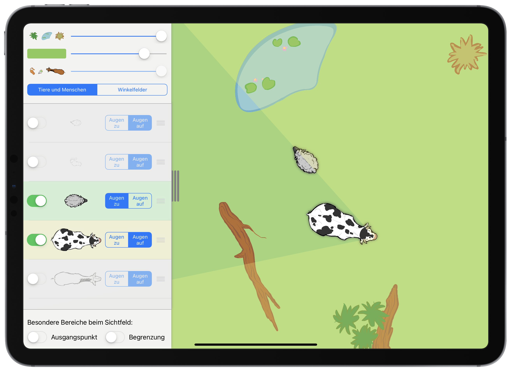

# (PART\*) Lernprozesse gestalten {.unnumbered}

# Lernprozesse auslösen

> **Ziele**
>
> + Sie kennen Möglichkeiten zur Motivierung und Zielbildung, um Lernprozesse bei Schülerinnen und Schülern auszulösen.
> + Sie können die verschiedenen Qualitäten der Orientierungsbildung beschreiben und erkennen Orientierungshilfen als Unterstützungsinstrumente höherwertiger Orientierungsbildung. 
> +Sie können unterrichtspraktische Herangehensweisen zum Auslösen von Lernprozessen lernpsychologisch begründen.
>
> **Material**
>
> + Folien zum Kapitel 5 ([pdf](files/Stoffdidaktik2024-05-LernprozesseAusloesen.pdf), [Keynote](files/Stoffdidaktik2024-05-LernprozesseAusloesen.key))


## Lerntätigkeit und Lernhandlung {#lerntaetigkeit-und-lernhandlung}

Eine Grundannahme der Tätigkeitstheorie, die auf Vygotskijs psychologische Arbeiten aus den 1920er Jahren in der Sowjetunion zurück geht, ist das Verständnis, dass sich **Individuen aktiv-handelnd mit ihrer Umwelt auseinandersetzen**, **die Umwelt** dabei in der Interaktion mit der Gesellschaft **verändern**, und beide Prozesse wiederum psychisch im Individuum abgebildet werden. Dies widerspricht bspw. der *behavioristischen* Annahme, dass man sich seiner Umwelt einfach nur anpasst, aber es ist auch nicht mit einer *streng konstruktivistischen* Annahme zu verwechseln, nach der Individuen ein Abbild der Umwelt kognitiv rekonstruieren. Die Tätigkeitstheorie kann eher als »(moderat) konstruktivistische[r][..] Ansatz« bezeichnet werden [@Giest2016a 47].

Zu betonen ist dabei die **beiderseitige Wirkrichtung**: Sowohl das Individuum wirkt auf die Umwelt ein (und verändert sie, es kommt zur *gesellschaftlichen Weiterentwicklung*), als auch die Umwelt auf das Individuum (was zur *Persönlichkeitsentwicklung* führt). Beide Prozesse sind dabei nicht voneinander zu trennen. Eine solche Interaktion ist von (gesellschaftlich entwickelten) Motiven geprägt und wird als ***Tätigkeit*** bezeichnet. @Giest2006 [27] formulieren: »Er [der Mensch] erschafft damit seine Kultur und zugleich die psychischen Funktionen, die ihn dazu in die Lage versetzen.« Dieses Paradoxon, dass die Tätigkeit ihre eigene Voraussetzung ist, kann aufgelöst werden, indem man zunächst kultur-historisch die gemeinschaftliche und erst dann die individuelle Tätigkeit betrachtet: »Durch (gemeinsame) Tätigkeit erfolgte die (kulturelle) Menschwerdung und über ihre individuelle Aneignung verläuft die Persönlichkeitsentwicklung« [@Giest2006, 27].

Für schulische Prozesse von besonderem Interesse ist die ***Lerntätigkeit***, in der Definition nach @Giest2006 [67]:

::: {.definition #Lerntaetigkeit name="Lerntätigkeit"}
Lerntätigkeit kann man definieren als die speziell auf die Aneignung gesellschaftlichen Wissens und Könnens (Lerngegenstände) gerichtete Tätigkeit, wozu spezifische Mittel (Lernmittel) unter speziell gestalteten Bedingungen eingesetzt werden müssen.
:::

@Giest2006 [67] führen fort: »Da die Lerngegenstände und Lernmittel kultureller Natur sind, kann Lerntätigkeit auch nur im Rahmen der Kultur, der Kooperation und Kommunikation mit denen, die über diese Kultur verfügen, angeeignet werden.« Dies betont in der Unterrichtsrealität u. a. die besondere Bedeutung und Verantwortung der Lehrkraft als wissende Person, die den Lernprozess der Schülerinnen und Schüler steuert. Dies heißt nicht, dass Unterricht lehrerzentriert gestaltet werden soll, ganz im Gegenteil: Entscheidend ist, dass die Lehrperson die Schülerinnen und Schüler dazu befähigt, sich den Lerngegenstand anzueignen, etwa indem sie geeignete Lernmittel zur Verfügung stellt und den Umgang mit ihnen schult.


Auch unabhänging vom Lernen sind Tätigkeiten stets auf einen **Gegenstand** bezogen, können also niemals inhaltsleer erfolgen. Tätigkeiten basieren dabei auf **Motiven**, d. h. »innere Antriebe« [@Giest2006 39]. Im Kontext des Lernens sind dies insbesondere die Motive *Interesse*, *Leistung*, *Affiliation* (soziale Nähe) und *Neugierde* [@Mienert2011 57]. In der Konfrontation mit einem Gegenstand bildet das Individuum, basierend auf die Motive, **Ziele** als »ideell vorweggenommene Resultate der Tätigkeit« aus [@Giest2006 39], was zu **Handlungen** im Zusammenhang mit dem Gegenstand führt. Handlungen dienen also der (zielgerichteten) Realisierung der Tätigkeit.
Im Rahmen der *Lerntätigkeit* führt dies dann zu ***Lernhandlungen***. @Lompscher1985b [46] definiert:

::: {.definition #Lernhandlung name="Lernhandlung"}
Lernhandlungen sind relativ geschlossene und abgrenzbare, zeitlich und logisch strukturierte Abschnitte im Verlauf der Lerntätigkeit, die ein konkretes Lernziel realisieren, durch bestimmte Lernmotive angetrieben werden und entsprechend den konkreten Lernbedingungen durch den Einsatz äußerer und verinnerlichter Lernmittel in einer jeweils spezifischen Folge von Teilhandlungen vollzogen werden.
:::


Aufbauend auf Lernziele können nun Lernhandlungen ausgebildet (also ausgeführt und verinnerlicht) werden. So können etwa als *Elementare Aneignungshandlungen* das **Identifizieren** und **Realisieren** genannt werden. Idenzifizieren ist die Prüfung der Passung eines gegebenen Objekt zur einer vorgegebenen Objektklasse und Realisieren das Erzeugen eines entsprechenden Repräsentanten. Identifizierungs- und Realisierungshandlungen sind v. a. bei der Erstbegegnung mit einem neuen Lerngegenstand -- insbesondere bei Begriffen -- von hoher Relevanz. Sie sind, in verinnerlichter Form, Voraussetzung für die noch folgenden Handlungsarten (und damit letztlich auch Bestandteile von ihnen). 
Darauf aufbauend können *Grundhandlungen* (**Erkennen**, **Beschreiben**, **Verknüpfen**, **Anwenden**^[Um hier einer ggf. eingeschränkten Auffassung des Vorgehens bei Sach- oder Modellierungsaufgaben (»Anwenden auf die Realität«) vorzubeugen, sei auf die Beschreibung verwiesen: »Feststellen der Übereinstimmung von den Bedingungen der Aufgabenstellung mit der Ausgangskonstellation der zu realisierenden gegebenen (oder erzeugten) Handlungsvorschrift (Identifizieren) und ggf. Herstellen einer solchen Übereinstimmung (Transferieren)« [@Feldt-Caesar2017 93]] und **Begründen**) sowie *komplexe Handlungen* (**Suchen**, **Planen**, **Ausführen** und **Kontrollieren**) erfolgen. Diese Handlungen sind i. d. R. in Festigungs- und Vertiefungsphasen bzw. bei Modellierungs- und Problemlösesituationen von Relevanz. Diese Art der Handlungskategorisierung geht auf @Bruder1989 zurück und wird nahezu unverändert auch bei @Feldt-Caesar2017 [{87 ff.}] dargestellt.

(ref:citeHandlungSchaf) Lernhandlung in der App *Winkel-Farm* [@Etzold:2019]

> Am Beispiel des Winkelfeldes in Abschnitt \@ref(konkrete-ebene) lautete eine Aufgabe für die Schülerinnen und Schüler: »Wo muss das Schaf lang laufen, damit es die gesamte Zeit gerade so von der Kuh gesehen wird?« Hierfür bewegen die Schülerinnen und Schüler in der App das Schaf entlang der Sichtfeldgrenze der Kuh, geradlinig und in Richtung der Augen der Kuh begrenzt und in die andere Richtung unbegrenzt. Sie *identifizieren und realisieren* damit das mathematische Objekt *Strahl*, gebunden am Kontext der Sichtfelder. Im Anschluss wird diese Handlung (kontextunabhängig) verallgemeinert und die Strahl-Eigenschaft des Schenkels charakterisiert.

```{r HandlungSchaf, echo=FALSE, fig.cap="(ref:citeHandlungSchaf)", fig.align='center', out.width='50%'}
 
```


Welche Schritte für die Ausbildung von Lernhandlungen notwendig sind, wird im nächsten Kapitel <!--einem Abschnitt \@ref(lernhandlungen-ausbilden)-->dargestellt.
Zu betonen ist, dass die Lernhandlungen zwar einerseits notwendig sind, um sich einem Lerngegenstand zu nähern, also die **Handlungen als *Lernmittel*** aufgefasst werden können. Andererseits müssen die Lernhandlungen jedoch auch erst einmal ausgeprägt werden, also auch die **Handlungen als *Lerngegenstand*** selbst aufgefasst werden (was wiederum nur am konkreten mathematischen Unterrichtsthema realisiert werden kann). Diese Sichtweise sollte Sie als Lehrkraft dafür sensibilisieren, dass Sie nicht per se davon ausgehen können, dass Ihre Schülerinnen und Schüler über entsprechende Handlungen verfügen, um neue mathematische Themen zu erlernen, sondern an diesen Themen die Handlungen erarbeitet und mit den Handlungen die Mathematik erarbeitet wird. Auch hier kann wieder von der zunächst gemeinschaftlichen Handlungsausführung (in der Klassensituation und mit Unterstützung von Personen, die über das anzueignende Wissen verfügen) zur individuellen Handlungsausführung (und damit persönlichen Aneignung des Lerngegenstands) übergegangen werden.


## Motivierung und Zielbildung

Die obigen Überlegungen zeigen, dass die **Motivierung und Zielbildung** bedeutsame Bestandteile eines Lernprozesses sind, sich also in der Gestaltung konkreter Unterrichtssituationen widerspiegeln müssen -- durch entsprechende Phasen innerhalb einer Unterrichtsstunde. Erst wenn Motive und Ziele ausgeprägt sind, kann es in weiteren Unterrichtsphasen zur **Ausbildung der Lernhandlungen** kommen<!-- (siehe auch Abbildung \@ref(fig:Unterrichtsphasen))-->.

### Zone der nächsten Entwicklung

Die Schülerinnen und Schüler müssen zunächst in die Lage versetzt werden, sich mit dem Lerngegenstand auseinandersetzen zu *wollen*. Hierzu ist es (aus lernpsychologischer Sicht) hilfreich, die Anforderungssituation in der **Zone der nächsten Entwicklung** der Schülerinnen und Schüler zu präsentieren. Dabei handelt es sich um eine Problemsituation, Aufgabe oder Fragestellung, die die Schülerinnen und Schüler zwar mithilfe ihrer bisherigen Kenntnisse, Fähigkeiten und Fertigkeiten **verstehen und nachvollziehen** können, zu ihrer Lösung sie jedoch noch **nicht selbstständig** (aber mit Unterstützung wissender Personen) in der Lage sind. Somit wird eine Motivation geschaffen, sich mit der Thematik tiefer auseinanderzusetzen. Es ist durchaus möglich, an dieser Stelle auch schon erste Lösungsversuche zu unternehmen. Daran ist besonders gut zu erkennen, »was wir nicht wissen bzw. können, um die Anforderung zu bewältigen« [@Lompscher1996 4].

Dem kann die **Zone der aktuellen Leistung** gegenübergestellt werden, also Probleme bzw. Aufgaben, die die Schülerinnen und Schüler bereits selbstständig lösen können. Würde jedoch jede Anforderungssituation in der Zone der aktuellen Leistung liegen, wäre langfristig kein Lernzuwachs möglich (und insbesondere könnte sich keine Motivation zum Lernen einstellen).

Ein bestimmtes Niveau eines Individuums ist dadurch gekennzeichnet, dass es zu bestimmten Dingen selbstständig in der Lage ist, zu anderen jedoch noch nicht. Der Übergang zum nächst höheren Niveau erfolgt, indem die soeben noch nicht selbstständig lösbaren Problemstellungen (in der Zone der nächsten Entwicklung) zu selbstständig lösbaren Problemstellungen (in der Zone der aktuellen Leistung) werden. Ein solcher Niveauübergang erfolgt @Lompscher1985b [26] zufolge durch »pädagogische Führung«. Diese etwas sperrige Bezeichnung drückt jedoch nichts anderes aus, als dass die Lehrkraft für die Gestaltung des Lernprozesses verantwortlich ist, damit die Schülerinnen und Schüler den entsprechenden Niveauübergang vollführen können.


(ref:citeZdnE) Zone der nächsten Entwicklung [nach @Lompscher1985b 26]

```{r ZdnE, echo=FALSE, fig.cap="(ref:citeZdnE)", fig.align='center', out.width='50%'}
knitr::include_graphics("pictures/5-ZdnE.png")
```

> Beim Winkelfeld wurden den Schülerinnen und Schülern Fotos verschiedener Tiere präsentiert, die teils ihre Augen an der Seite des Kopfes und teils nach vorn gerichtet hatten. Es wurde besprochen, was diese Tiere unterscheidet (Flucht- und Jagdtiere) und welche Bedeutung die Lage der Augen hierfür haben kann. Diese Situation ist für die Schülerinnen und Schüler nachvollziehbar, aber sie können noch nicht selbstständig beschreiben, welcher geometrische Zusammenhang zwischen der Position der Augen und der Lebensweise der Tiere besteht.


### Lernzielbildung

Aus dem Motiv heraus, sich mit einem konkreten Lerngegenstand zu beschäftigen, erfolgt eine geistige Vorwegnahne, was das *Ergebnis* der Lerntätigkeit ist. Darunter sind neue »Handlungen, Verhaltensweisen, Bedeutungen, Werte, Normen, Begriffe, Gesetzmäßigkeiten usw. in Form von Kenntnissen, Fähigkeiten, Einstellungen und anderen psychischen Eigenschaften« zu verstehen [@Lompscher1985b 40]. Solche (psychischen) Ergebnisse unterscheiden sich damit von (äußeren) *Produkten* wie »Zeichnungen, schriftliche Arbeiten, Materialsammlungen, Werkstücke, mündliche Aussagen u. a.« [@Lompscher1985b 40].

Die Orientierung darauf, eines der *Ergebnisse* zu erzielen, entspricht demnach dem **Lernziel**. Hier ist zu beachten, dass das *Lernziel* nicht zu verwechseln ist mit dem von der Lehrkraft erwünschten *Lehrziel*.^[Erst recht nicht zu verwechseln ist der Begriff mit den »Lernzielen« außerhalb der Tätigkeitstheorie, die bspw. bei einer Unterrichtsplanung angegeben werden. Letztere entsprechen eher den Lehrzielen und können auch -- um Verwechslungen zu vermeiden -- als *Kompetenzziele* bezeichnet werden, da sie Kompetenzen beschreiben, die am Ende der entsprechenden Unterrichtsstunde ausgebildet worden sein sollen.] Lernziele werden individuell von den Schülerinnen und Schülern ausgeprägt. Sie haben jedoch als Lehrkraft die Aufgabe, eine solche Lernzielbildung zu unterstützen und idealerweise auch zu lenken, so dass die Schülerinnen und Schüler für den Lerngegenstand adäquate Lernziele bilden. Der Grad der **Bewusstheit, Allgemeinheit und Differenziertheit** des Lernziels bestimmt dabei letztlich auch, in welcher Qualität die darauf basierenden Lernhandlungen ausgeprägt werden [vgl. @Lompscher1985b 43]. Möchte ein Kind einfach nur die Lösung der Aufgabe $17+8$ ermitteln (Produktorientierung), so wird es nicht so qualitativ hochwertig und nachhaltig lernen können, als wenn es das Ziel verfolgt, grundsätzlich Additionsaufgaben mit Zehnerübergang lösen zu können (Ergebnisorientierung).

Es bietet sich eine **explizite Verbalisierung und auch das Festhalten von Lernzielen** (z. B. an der Tafel) an, um während des Lernprozesses darauf zurückgreifen und seinen eigenen Handlungsfortschritt permanent mit den Zielen abgleichen zu können<!-- (vgl. *Handlungskontrolle* in Abschnitt \@ref(handlungskontrolle))-->.


> Anknüpfend an die Präsentation der Tierbilder zu Winkelfeldern wurde, von der Lehrkraft durch ein Lehrer-Schüler-Gespräch initiiert, als Lernziel formuliert: »Wir wollen Sichfelder von Tieren beschreiben und miteinander vergleichen« [vgl. @Etzold:2019Praxis4 6]. Diese Zielformulierung enthält bewusst keine mathematischen Fachbegriffe des neuen Lerngegenstandes, da diese zum entsprechenden Zeitpunkt ja noch gar nicht erarbeitet worden sind.


Wie das Beispiel schon zeigt, müssen Motivierung und Zielbildung nicht als getrennte Unterrichtsphasen strukturiert werden. Relevant ist jedoch, *dass* sie stattfinden und einen bedeutsamen Raum im Unterricht einnehmen. Ein Unterrichtsbeginn mit »Wir beschäftigen uns heute mit …« liefert eben i. d. R. keine Motivation und löst in den Schülerinnen und Schülern keine Lernzielbildung aus, was für den weiteren Lernprozess extrem hinderlich ist. Auch zeigt sich hier wieder die **Bedeutung der Lehrkaft**: Sie ist diejenige, die die Schülerinnen und Schüler in die Lage versetzen kann, sich dem Lerngegenstand zu nähern. Das heißt insbesondere auch, dass ein *Ostereiersuchen* vermieden werden muss (bei dem die Schülerinnen und Schüler z. B. so lange raten, um was es denn heute gehen könnte, bis sie die richtige Antwort gefunden haben), sondern die Lehrkraft *instruiert* (persönlich oder durch geeignete Aufgabenstellungen) unter Berücksichtigung der individuellen Voraussetzungen der Schülerinnen und Schüler einen ersten Zugang zum Lerngegenstand. Damit ist die Lehrkraft ein Vertreter des gesellschaftlichen Wissens und Könnens, das sich die Schülerinnen und Schüler als Kenntnisse, Fähigkeiten und Fertigkeiten aneignen werden.


## Orientierungsbildung

Mit der Erfassung einer Anforderungssituation geht ad hoc eine Orientierung der Schülerinnen und Schüler bezüglich der möglichen Bearbeitung einher. Dabei wird in drei Qualitäten von ***Orientierungsgrundlagen*** unterschieden [als Zitate gekennzeichnete Formulierungen sind entnommen aus @Feldt-Caesar2017 {83 ff.}]:

* **Probierorientierung:** Die Schülerinnen und Schüler verfügen noch nicht über für die Aufgabenbewältigung nötigen Kenntnisse, Fähigkeiten oder Fertigkeiten. Stattdessen gehen sie nach Versuch und Irrtum vor. Dabei fehlt ihnen »häufig die Einsicht, warum eine bestimmte Handlung zum Erfolg geführt hat, eine andere jedoch nicht. […] Aufgrund der mangelnden Einsicht in die wirklichen Bedingungen der Handlungen ist eine erfolgreiche Handlung nicht notwendigerweise reproduzierbar.« Dies führt dazu, dass erfolgreiche Handlungen kaum auf veränderte Situationen übertragen werden können. Eine derartige Orientierung ist also höchstens »in Aneignungsprozessen zu einem Explorieren des neuen Inhaltsbereichs« wünschenswert, darüber hinaus jedoch sollten höhere Orientierungsgrundlagen angestrebt werden.

* **Musterorientierung:** Die Schülerinnen und Schüler gehen nun nicht mehr nach Versuch und Irrtum vor, sondern orientieren sich an bereits erfolgreich durchgeführten Handlungen in ähnlichen Anforderungssituationen -- die sozusagen als Muster dienen.
»Dieser Orientierungstyp ist nur dann erfolgreich, wenn die gegebene Anforderungssituation dem erlernten Muster ähnlich genug ist, um eine Passung zu ermöglichen. Tragfähig ist ein Muster nur dann, wenn seine Handlungsbedingungen genau gekannt und stets geprüft werden.«
Es handelt sich also zwar um eine vollständige Orientierungsgrundlage, jedoch ist eine Transferierbarkeit nicht immer gegeben. Auch kann die »fälschliche Erkennung eines Musters in einer gegebenen Anforderungssituation« zu einer fehlerhaften Übertragung führen.

* **Feldorientierung:** Die Schülerinnen und Schüler sind nun »nicht an eine konkrete Anforderungssituation gebunden, sondern beziehen sich vielmehr auf ganze Anforderungsklassen. Durch das Erkennen der Passung einer solchen Anforderungsklasse kann sich der Lernende für konkrete Situationen selbst eine Orientierung schaffen. Er verfügt über einen gewissen Überblick über die Situation und ist in der Lage zu differenzieren, welche Stoffelemente und welche seiner Kenntnisse, Fähigkeiten und Fertigkeiten ihm bei der Bewältigung der Anforderung weiterhelfen können und welche nicht.« Aufgrund des hohen Maßes an Übertragbarkeit ist eine Feldorientierung insbesondere für Kenntnisse, Fähigkeiten und Fertigkeiten, die in den Bereich von Mindeststandards fallen, von Bedeutung: »Feldorientierung gilt als erstrebenswert für solche Lerninhalte, die für erfolgreiches Weiterlernen unabdingbar sind.« [@Richter2016 195]

Auch wenn eine Feldorientierung erstrebenswert ist, wird diese vermutlich nicht immer von allen Schülerinnen und Schülern erreicht werden können. Diesen Schülerinnen und Schülern sollten Sie jedoch dahingehend Unterstützung bieten, zumindest eine Musterorientierung zu erlangen. Hierzu gehört auch, das *Erfüllen eines Musters* explizit zu machen, also bei gegebenen Aufgabenstellungen zu untersuchen, inwieweit diese einem bereits bekannten Muster entsprechen und wie sie damit lösbar sind. Ebenfalls hilfreich, und auch den Übergang zur Feldorientierung stützend, sind **Orientierungshilfen**, also Verbalisierungen oder Repräsentationen zum Lerngegenstand, die beim Finden geeigneter Lernhandlungen unterstützen. Solche Orientierungshilfen sollten gemeinsam aus der ersten Beschäftigung mit dem Lerngegenstand herausgearbeitet und in den Umgang mit ihnen eingeführt werden, damit sie sinnvoll in den Lernprozess integriert werden können.

Beispiele für Orientierungshilfen bei der Aneignung von Begriffen, Zusammenhängen und Verfahren finden sich in den nächsten Kapiteln<!-- \@ref(begriffe-sachverhalte-und-verfahren).
Auch die nach Definition \@ref(def:Arbeitsmittel) eingeführten Arbeitsmittel können die Funktion einer Orientierungshilfe erfüllen, da sie nach Definition sogleich abstrakt wie anschaulich (in der dort verwendeten Charakterisierung) sind-->.

> Die App Winkel-Farm unterstützt die Aneignung des Begriffs »Schenkel« eines Winkel mit dessen Strahl-Eigenschaft, indem sich die Bestandteile des Winkelfeldes ein- und ausblenden lassen sowie vom *Tiermodus* in den *Winkelfeldmodus* gewechselt werden kann und damit das Wesen des Begriffs hervorgehoben werden kann.


## Bezüge zur Stoffdidaktik {#bezuege-zur-stoffdidaktik}


* Der **Lerngegenstand** selbst als Ausschnitt des gesellschaftlichen Wissens und Könnens entspricht einem der Mathematik entstammenden `r formal("**Begriff**, **Zusammenhang** oder **Verfahren**")` bzw. einem Ausschnitt `r formal("**metamathematischen Wissens**")`. Er hat daher eine gesellschaftliche und historische Bedeutung, die es im Unterricht zu transportieren gilt.

* Für die **Motivierung und Zielbildung** sollte ein `r concrete("**sinnstiftender Kontext**")` herangezogen werden, der in besonderer Weise charakteristisch für den zu erlernenden Lerngegenstand ist. Die `r concrete("**Kernidee in der Vorschauperspektive**")` unterstützt bei der Zielbildung, um das Wesen des neuen Lerngegenstands im Vorfeld deutlich machen zu können und die erwünschten Handlungsergebnisse im Blick zu haben. Es ist durchaus möglich, dass die explizite Lernzielformulierung in Form der `r concrete("**Kernfragen**")` erfolgt. Auch das `r semantic("**Explizitmachen fundamentaler Ideen**")` kann die Einordnung des neuen Lerngegenstands unterstützen.^[Dies ist eine Adaption eines bei @Reitz-Koncebovski2018 [182] dargestellten Gestaltprinzips fachwissenschaftlicher Lehrveranstaltungen in der Lehramtsausbildung.]

Für die Unterrichtgestaltung wurde bisher verschwiegen, dass die Lernhandlungen selbstverständlich auf Vorkenntnisse und -fertigkeiten aufbauen und dieser bedürfen. Es ist daher unerlässlich, das für die neu zu erwerbenden Lernhandlungen benötigte **Ausgangsniveau zu sichern** (was dann die *Zone der aktuellen Leistung* charakterisiert). Dies kann in **Wiederholungsphasen** zum aktuell benötigten Stoff erfolgen, dauerhaft und langfristig auch in (unbenoteten) **täglichen Übungen / vermischten Kopfübungen** zum »Wachhalten von Basiswissen« [siehe auch @Bruder2008b].


## Zum Nachbereiten {#taetigkeitstheorie-nachbereitung}

Lösen sie folgende Aufgaben am Beispiel des Lerngegenstands *Vierecksarten*.

1. Formulieren Sie eine Anforderungssituation in der Zone der nächsten Entwicklung und stellen Sie dar, inwieweit diese zwar verstanden und nachvollzogen, aber noch nicht selbstständig gelöst werden kann.

2. Geben Sie mögliche Lernziele für den Lerngegenstand an.

3. Entwerfen Sie eine Orientierungshilfe zum Identifizieren von Vierecksarten.

