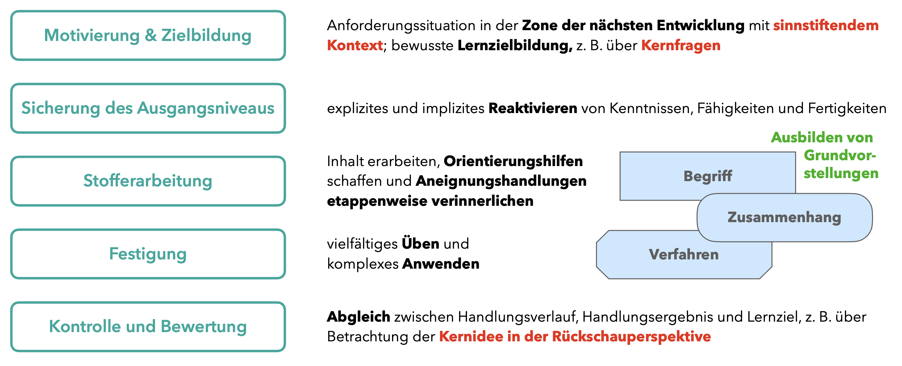

# Lernhandlungen ausbilden

> **Ziele**
>
> + Sie können typische Unterrichtssituationen im Mathematikunterricht benennen, beschreiben und lernpsychologisch begründen.
> + Ihnen ist die Bedeutsamkeit von Identifizierungs- und Realisierungshandlungen in der Stoffvermittlung bewusst.
> + Sie kennen eine Möglichkeit, wie geistige Handlungen schrittweise ausgebildet werden können.
>
> **Material**
>
> + Folien zum Kapitel 6 ([pdf](files/Stoffdidaktik2024-06-LernhandlungenAusbilden.pdf), [Keynote](files/Stoffdidaktik2024-06-LernhandlungenAusbilden.key))


## Aneignung von Lerngegenständen {#aneignung-von-lerngegenstaenden}

### Vermittelnde Werkzeuge

Nach @Wygotski1985a erfolgt eine Interaktion eines Individuums mit einem Lerngegenstand niemals direkt, sondern geschieht stets über ein **vermittelndes Werkzeug**. Es kann sich dabei um *echte* Werkzeuge (wie Maschinen, Geräte und andere Hilfsmittel handeln) oder um *psychische* Werkzeuge handeln, also Gesten, die Sprache, Abbildungen und Skizzen oder ähnliches. Entscheidend ist, dass dieses vermittelnde »Ding« für das Individuum die Funktion eines Vermittlers erfüllt.

Durch die Nutzung eines geeigneten Werkzeugs ist das Individuum damit einerseits in der Lage, seine Kenntnisse, Fähigkeiten und Fertigkeiten zu ***externalisieren***, d. h. das Werkzeug zielgerichtet so einzusetzen, dass auf den Lerngegenstand eingewirkt werden kann. Andererseits kann das Werkzeug auch dabei helfen, Eigenschaften des Lerngegenstands zu ***internalisieren***, indem die Werkzeugnutzung dazu führt, dass das Individuum Kenntnisse, Fähigkeiten und Fertigkeiten über den Lerngegenstand gewinnt. Um sich also einen Lerngegenstand *anzueignen*, sind sowohl stets Externalisierungs- als auch Internalisierungsprozesse notwendig. Man kann auch sagen, dass **Aneignung als Einheit aus Externalisierung und Internalisierung** aufzufassen ist.

```{r SubjektObjekt2, echo=FALSE, fig.cap="Die Nutzung eines Zirkels zur Aneignung des Kreis-Begriffs", fig.align='center', out.width='75%'}
knitr::include_graphics("pictures/6-Aneignung.png")
```

### Zur Rolle des Sprechens
Eine wichtige Rolle beim Aneignen spielt das **Sprechen über die durchgeführten Handlungen**. Dieses dient quasi als Bindeglied zwischen geistiger Handlung und praktisch-gegenständlicher Handlung, da es sowohl den Externalisierungsprozess unterstützt (das Geistige muss über das Sprechen externalisiert werden) als aus der Internalisierung dienlich ist (über das Sprechen wird das Praktisch-Gegenständliche psychisch verarbeitet). Damit unterstützt das Sprechen auch eine **schrittweise Abkehr vom externen Werkzeug** und damit eine geistige Durchdringung des betrachteten Lerngegenstands. Abbildung \@ref(fig:GVverinnerlichen) zeigt eine entsprechende Schrittfolge zum Aufbau von Grundvorstellungen, wie sie @Wartha2011 [11] vorschlagen  (wobei die dort verwendeten Farben nichts mit den hier im Skript genutzten Farben für die vier Ebenen zu tun haben).

(ref:GVverinnerlichen) Aufbau von Grundvorstellungen nach @Wartha2011 [11]

```{r GVverinnerlichen, echo=FALSE, fig.cap="(ref:GVverinnerlichen)", fig.align='center', out.width='75%'}
knitr::include_graphics("pictures/6-GVverinnerlichen.png")
```

In Abschnitt \@ref(ausfuehren-und-verinnerlichen) wird diese Sichtweise noch einmal mit tätigkeitstheoretischen Theorien in Bezug gebracht.


## Typische Lernhandlungen

Während Lern*tätigkeit* allgemein auf die *Aneignung* von Lerngegenständen fokussiert, kann diese nur über Lern*handlungen* realisiert werden, also zielgerichtetes Vorgehen zur Auseinandersetzung mit dem Lerngegenstand. 
Unabhängig von konkreten Lerngegenständen haben @Bruder1989 typische Lernhandlungen für den Mathematikunterricht strukturiert beschrieben (bereits kurz erwähnt in Abschnitt \@ref(lerntaetigkeit-und-lernhandlung)), die hier noch einmal ausführlicher dargestellt und mit Beispielen belegt sind [Hervorhebungen im Original, auch dargestellt bei @Feldt-Caesar2017 {87 ff.}]:

### Elementare Aneignungshandlungen
  * **Identifizieren:** »Vergleichen der aufgenommenen Informationen zu Teilen oder Eigenschaften eines Objektes mit den Merkmalen bestimmter aktualisierter Abbilder (Stoffelemente, Handlungsvorschriften ...) und Feststellung von Übereinstimmung oder Nichtübereinstimmung auf der Grundlage eines den jeweiligen Abbildungsmerkmalen entsprechenden *Idealisierens* der gegebenen Objektsituation«
  
    > Beispiel: Erkennen, ob eine vorgegebene Figur ein Quadrat ist, nachdem der Begriff des Quadrats eingeführt wurde 
  
  * **Realisieren:** »*Transferieren*, Konkretisieren oder Spezialisieren eines vorgegebenen (bzw. identifizierten) Handlungsgegenstandes (Stoffelemente, Vorgehensstrategien ...) auf eine gegebene Objektsituation und *Zusammenfügen* der so erzeugten Teile zu einem neuen Ganzen«
  
    > Beispiel: Angeben eines Beispiels für ein Zufallsexperiment, nachdem der Begriff des Zufallsexperiments eingeführt wurde
  
  
### Grundhandlungen
  * **Erkennen:** »Ausgliedern wahrgenommener Informationen aus der Aufgabenstellung und Inbeziehungsetzen mit ausgegliederten bekannten (gespeicherten) Abbildern bzw. der neu zusammengefügten Abbilder, bis eine Übereinstimmung festgestellt wird«
    
    > Beispiel: Bestimmen der Nullstelle einer Funktion anhand des Funktionsgraphen. Hierbei muss zunächst anhand des Graphen identifiziert werden, dass die Stelle, an der der Graph die y-Achse schneidet, die Nullstelle ist. Anschließend muss der entsprechende Wert abgelesen werden.
    
    
  * **Beschreiben:** »Identifizieren und Realisieren einer dem gespeicherten (oder erzeugten) Abbild adäquaten umgangssprachlichen Formulierung oder Darstellung in mathematischer Terminologie und Symbolik und Entäußerung der Informationen auf sprachlicher oder materialisierter Ebene«
    
    > Beispiel: Vorgehen beschreiben, wie ein Kreis mit einem vorgegebenen Radius gezeichnet wird 
  
  * **Verknüpfen:** »*Transferieren* und *Zusammensetzen* von Zusammenhängen (Sätzen, Verfahren) oder Vorgehensstrategien zu einem neuen Ganzen durch Ersetzungen in der Ausgangskonstellation von Zusammenhängen«
    
    > Beispiel: Finden einer Teilbarkeitsregel für 16, wenn die Teilbarkeitsregeln für 2, 4 und 8 bereits bekannt und begründet worden sind
  
  * **Anwenden:** »Feststellen der Übereinstimmung von den Bedingungen der Aufgabenstellung mit der Ausgangskonstellation der zu realisierenden gegebenen (oder erzeugten) Handlungsvorschrift (Identifizieren) und ggf. Herstellen einer solchen Übereinstimmung (Transferieren)«  
     
    > Beispiel: Bestimmen der Lösungsmenge eines vorgegebenen linearen Gleichungssystems mithilfe des Additionsverfahrens.
    
    Mit *Anwenden* in diesem Sinne ist nicht die Anwendung auf eine Realsituation gemeint.
  
  * **Begründen:** »a) Vergleichen eines vorgegebenen Sachverhalts mit gegebenen bzw. bekannten Normativen; b) Realisieren gegebener bzw. identifizierter elementarer Beweisverfahren«
    
    > Beispiel: Begründen, warum die Summe dreier aufeinanderfolgender natürlicher Zahlen durch 3 teilbar ist

### Komplexe Handlungen
  * **Suchen:** »Ergebnis von Suchhandlungen sind zieltaugliche Mittel (Stoffelemente, Zuordnungen, Vorgehensstrategien) zur Lösung der gestellten Aufgabe – gewonnen durch mehr oder weniger bewußte Anwendung von Suchstrategien«
    
    > Am Beispiel der Modellierungsaufgabe »Wie viele Luftballons passen in diesen Raum?«: Suchen des Lösungsansatzes, die Situation geometrisch zu modellieren
  
  * **Planen:** »Durch Anwenden von Vorgehensstrategien wird ein Arbeitsplan mit den erforderlichen Teilschritten zur Zielrealisierung entwickelt«
  
    > Am Beispiel der Modellierungsaufgabe »Wie viele Luftballons passen in diesen Raum?«: zunächst Modellieren des Raums als Quader, der Luftballons als Kugeln; dann Schätzen/Messen der Größen und Nutzen der Volumenformeln; weiterhin Inbeziehungsetzen der Volumina
  
  * **Ausführen:** »Abarbeiten eines Arbeitsplanes – Handlungsvollzug auf der Grundalge der ausgebildeten Orientierungsgrundlage u. a. als Berechnen, geometrisches Darstellen, Definieren, Darstellen eines Beweises«
  
    > Am Beispiel der Modellierungsaufgabe »Wie viele Luftballons passen in diesen Raum?«: Berechnen der entsprechenden Größen
  
  * **Kontrollieren:** »Feststellen der Zweckmäßigkeit und Exaktheit von Teilschritten des Aufgabenlösens und des Resultats (Handlungsprodukt!)«
  
    > Am Beispiel der Modellierungsaufgabe »Wie viele Luftballons passen in diesen Raum?«: Validieren des Ergebnisses; ggf. Entscheidung zu weiterem Durchgang des Modellierungskreislaufes
  
Diese Handlungen müssen nun je nach Lerngegenstand noch konkretisiert werden.


## Ausführen und Verinnerlichen {#ausfuehren-und-verinnerlichen}

Am neu zu erlernenden Lerngegenstand werden die Schülerinnen und Schüler nun **an die Ausführung geeigneter Lernhandlungen herangeführt**, was bspw. über ein Vorführen und Erklären durch die Lehrkraft erfolgen kann. Die Ausführung durch die Schülerinnen und Schüler darf jedoch nicht mit einem *Nachahmen* verwechselt werden. Vielmehr erfolgen die Handlungen **einsichtig** und das **Lernziel verfolgend**, ggf. unter **Verwendung der Orientierungshilfen**. Je nach Vorkenntnissen können die Schülerinnen und Schüler auch, angeregt durch entsprechende Aufgabenstellungen, selbstständig die neuen Lernhandlungen durchführen, wobei nicht davon auszugehen ist, dass sie bereits über alle Voraussetzungen verfügen, die Lernhandlungen vollumfänglich zu nutzen (denn sonst wäre die zugehörige Anforderungssituation nicht in der Zone der nächsten Entwicklung gewesen).

Um die Lernhandlungen zu *verinnerlichen* (genauer: um sie *anzueignen*, was stets als Einheit aus Entäußerung und Verinnerlichung anzusehen ist -- vgl. Abschnitt \@ref(aneignung-von-lerngegenstaenden)) schlägt Gal'perin eine **»etappenweise Interiorisierung«** vor [vgl. @Lompscher1985a {66 f.}]:

* **Etappe der materiellen bzw. materialisierten Handlung**: Die Handlungen werden mit konkretem Material (z. B. Arbeitsmitteln) oder anderen schriftlich vorliegenden Orientierungshilfen zum Lerngegenstand durchgeführt.

* **Etappe der sprachlichen Handlung**: Die Handlungen werden ohne oder nur mit geringer Zuhilfenahme des Materials durchgeführt und dabei durch äußeres (oder inneres) Sprechen beschrieben. Dabei wird i. d. R. Bezug auf die vorherigen Handlungen genommen.

* **Etappe der geistigen Handlung**: Die Handlungen werden nun rein kognitiv durchgeführt und bedürfen weder des Materials noch der Sprache.

Diese Etappen führen letztlich dazu, die Lernhandlungen (und damit auch den Lerngegenstand, an dem diese Handlungen durchgeführt werden) psychisch abbilden zu können, was zur »Verallgemeinerung, Verkürzung und Beherrschung« der Handlungen führt [@Steinhofel1988 19]. Abbildung \@ref(fig:Etappen) zeigt hierzu einige Realisierungsmöglichkeiten für den Mathematikunterricht.

(ref:citeEtappen) Beispiele zur etappenweisen Verinnerlichung von Handlungen im Mathematikunterricht nach @Steinhofel1988 [19]

```{r Etappen, echo=FALSE, fig.cap="(ref:citeEtappen)", fig.align='center', out.width='90%'}
knitr::include_graphics("pictures/6-Etappen.png")
```

Besonders bedeutsam sind derartige Verinnerlichungsprozesse für die *elementaren Aneignunghandlungen* **Identifizieren und Realisieren** (vgl. Abschnitt \®ref(elementare-aneignungshandlungen). Derartige Handlungen sollten also direkter **Bestandteil der Stoffvermittlung** sein und nicht dem zufälligen Erwerb in anschließenden Übungsphasen überlassen werden.


## Festigung

Ist eine sogenannte *Erstaneignung* eines Lerngegenstands erfolgt, kann dieser nun **gefestigt** werden. Hierzu sind sowohl automatisierende als auch produktive Übungen^[Mehr dazu finden Sie z. B. im [Stoffdidaktik-Skript von 2022/23](https://stoffdidaktik.heiko-etzold.de/2022/8-aufgabengestaltung.html#produktives-üben).] notwendig. @Steinhofel1988 [34] schlagen hierfür verschiedene Maßnahmen zum Umgang mit dem Lerngegenstand vor: 

* Verwendung von Spezial- und Extremfällen  
* Umformulieren, Bedingungen variieren, Umkehrungen bilden  
* Verwendung unterschiedlicher Bezeichnungen  
* Bekanntes Neuem gegenüberstellen und Zusammenhänge erkennen lassen  

Im Sinne der Typisierung von Lernhandlungen (siehe Abschnitt \@ref(typische-lernhandlungen)) bezieht sich dies v. a. auf *Grundhandlungen* und *komplexe Handlungen*.


## Handlungskontrolle

Die Handlungsausführung sollte stets von einer **Handlungskontrolle** begleitet werden. Das bedeutet, dass die Schülerinnen und Schüler eine bewusste Beziehung herstellen zwischen ihren (erreichten oder zu erreichenden) Handlungsergebnissen, den eingesetzten Lernmitteln sowie deren Bedingungen und der eigenen Handlungsausführung.
Die Handlungskontrolle ist dabei eine *Selbstkontrolle* und muss dementsprechend auch erst einmal ausgebildet werden. Folgende methodischen Maßnahmen scheinen hierfür hilfreich zu sein:

* Ein Abgleich mit den zu erreichenden Handlungsergebnissen ist nur möglich, wenn im Vorfeld eine Zielklarheit besteht. Daher ist es so wichtig, die **Lernziele explizit zu formulieren und auch festzuhalten**.
* Durch das **Anfertigen eines Lernprotokolls** [vgl. @Bruder2011] erhalten die Schülerinnen und Schüler eine Möglichkeit, ihre eigenen Lernhandlungen und -ergebnisse zu dokumentieren und nachzuvollziehen. Insbesondere kann in diesem auch ohne jeglichen Bewertungsdruck dargestellt werden, wo man selbst als Schülerin oder Schüler noch Lücken sieht bzw. was man noch nicht verstanden hat.

* Als weitere effektive Maßnahme in der Ausbildung der Handlungskontrolle hat sich die **gegenseitige Kontrolle der Schülerinnen und Schüler** als hilfreich herausgestellt. »Es läßt sich zunächst beim Partner leichter feststellen als bei sich selbst, inwieweit ein Handlungsergebnis bestimmten Zielkriterien entspricht, die Handlungsausführung anforderungs- und regelgerecht erfolgt, wo Abweichungen und Fehler liegen und worin die Ursachen dafür bestehen können« [@Lompscher1985a 72]. Durch Verinnerlichung dieses Vorgehens kann dann schrittweise auch eine Selbstkontrolle erfolgen.

Die Handlungskontrolle leistet damit einen Beitrag, die Schülerinnen und Schüler langfristig zu einer Feldorientierung über den Lerngegenstand zu befähigen.


## Bezüge zur Stoffdidaktik {#bezuege-zur-stoffdidaktik-lernhandlungen}

* Die **etappenweise Verinnerlichung von Handlungen** kann dabei unterstützen, `r semantic("**Grundvorstellungen aufzubauen**")`. Das in Abb. \@ref(fig:GVverinnerlichen) dargestellte Phasenmodell von @Wartha2011 [11] erinnert stark an die etappenweise Verinnerlichung von Lernhandlungen nach Gal'perin. Dabei verwendete `r semantic("**Arbeitsmittel**")` und `r semantic("**Repräsentationen**")` können als **Orientierungshilfe** dienen und unterstützen die Aneignung.

* In der **Handlungskontrolle** wird über den Abgleich zwischen Handlungszielen, -durchführung und -ergebnissen die `r concrete("**Kernidee in der Rückschauperspektive**")` aufgegriffen.

Insgesamt ergeben sich aus den Überlegungen **typische Unterrichtssituationen**. Abbildung \@ref(fig:Unterrichtsphasen) zeigt diese in Anlehnung an @Bruder1991 mit ihrem Zusammenhang zu den stoffdidaktichen Theoriebestandteilen.

(ref:citeUnterrichtsphasen) Typische Unterrichtssituationen nach @Bruder1991

```{r Unterrichtsphasen, echo=FALSE, fig.cap="(ref:citeUnterrichtsphasen)", fig.align='center', out.width='95%'}

```

Im nächsten Kapitel wird -- aufgeschlüsselt nach Begriffen, Zusammenhängen und Verfahren -- insbesondere dargestellt, wie Stoffvermittlung und Festigung allgemein gestaltet werden können. 
All diese Überlegungen sind jedoch nicht als starres Unterrichtsvorgehen aufzufassen, sondern sollen vielmehr Ihnen als Lehrkraft wiederum eine *Orientierung* bieten, Ihren Unterricht zu strukturieren und entsprechende Lernumgebungen zu gestalten.

