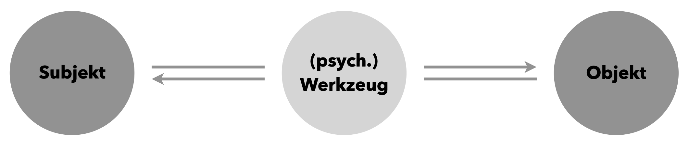

<!--
# Arbeitsmittel

> **Ziele**
>
> + Sie können den Begriff des Arbeitsmittels in den Vier-Ebenen-Ansatz sowie tätigkeitstheoretisch einordnen.
> + Sie kennen ein Instrument zur Analyse von Arbeitsmitteln.
> + Sie sind, ggf. mit Unterstützung, in der Lage, Arbeitsmittel strukturiert zu analysieren.
>
> **Material**
>
> + Folien zur Vorlesung zu Arbeitsmitteln ([pdf](files/Stoffdidaktik-WiSe2223-Kap7.pdf), [Keynote](files/Stoffdidaktik-WiSe2223-Kap7.key))


## Begriffsklärung und Einordnung {#arbeitsmittel-begriffsklaerung}

Ausgehend von den im letzten Kapitel dargestellten theoretischen Betrachtungen, kommt *Lernmitteln* (siehe Abschnitt \@ref(taetigkeitstheorie-und-lernen)) bzw. *Material* (siehe Abbildung \@ref(fig:GVVerinnerlichen)) eine bedeutsame Rolle in der Ausbildung und Verinnerlichung von Lernhandlungen zu. Die Begrifflichkeiten sind jedoch nicht gleichzusetzen, was in diesem Abschnitt genauer herausgearbeitet werden soll. 

*Lernmittel* haben eine allgemeineren Charakter und entstammen einer weiteren tätigkeitstheoretischen Annahme: Tätigkeiten erfolgen nach @Wygotski1985a niemals direkt zwischen einem Individuum (dem **Subjekt**) und dem zu betrachtenden Gegenstand (dem **Objekt**), sondern geschehen stets über ein **vermittelndes Werkzeug**. Ein solches Werkzeug kann eine Geste sein, die Sprache (als Beispiel für ein sogenanntes *psychisches Werkzeug*), Abbildungen und Skizzen, aber eben auch *echte* Werkzeuge wie Maschinen, Geräte und andere Hilfsmittel.

```{r SubjektObjekt, echo=FALSE, fig.cap="Werkzeuge als Vermittler in der Tätigkeitstheorie", fig.align='center', out.width='75%'}

```

Durch die Nutzung eines geeigneten Werkzeugs ist das Subjekt damit einerseits in der Lage, sein eigenes Wissen zu ***externalisieren***, d. h. das Werkzeug zielgerichtet so einzusetzen, dass auf das Objekt eingewirkt werden kann. Andererseits kann das Werkzeug auch dabei helfen, Eigenschaften des Objekts zu ***internalisieren***, indem die Werkzeugnutzung dazu führt, dass das Subjekt Kenntnisse über das Objekt gewinnt. 

Im Rahmen der Lerntätigkeit sind solche (ggf. psychischen) Werkzeuge dann *Lernmittel* und können vielfältigster Natur sein:

* Mithilfe eines *Zirkels* können Kreise erzeugt werden, indem der Zirkel seiner Funktion entsprechend verwendet wird (Externalisierung der Kenntnisse über den Kreis). Die Gestaltung und Handhabung des Zirkels selbst vermittelt jedoch auch Wissen über den Kreisbegriff, so dass dieses in der Verwendung des Werkzeugs aufgebaut werden kann (Internalisierung des Wissens über den Kreis).
* Die *digitale Stellenwerttafel* ermöglicht es, das Stellenwertverständnis zu Zahlen aufzubauen und Zahlen entsprechend darzustellen. Durch das Verhalten der Anwendung (dass z. B. ein Plättchen beim Verschieben von der Zehner- in die Einer-Spalte automatisch entbündelt wird) unterstützt diesen Aneignungsprozess [siehe @Kortenkamp2018a]. 
* Auch *Aufgaben* haben die Funktion eines (bedeutsamen!) Lernmittels, wenn sie als Aufforderung zum Lernhandeln aufgefasst werden (siehe Abschnitt \@ref(funktionen-von-aufgaben)). An ihnen erarbeiten sich die Schülerinnen und Schüler bestimmte Elemente des Lerngegenstands und die Gestaltung der Aufgabe sowie die vorhandenen Kenntnisse der Schülerinnen und Schüler bestimmen den Verlauf und Erfolg der Lernhandlung.

Der *Material*-Begriff dagegen ist enger als der Begriff des *Lernmittels* und stammt nicht aus der Tätigkeitstheorie. Verbreiteter und konkreter fassbar in der Mathematikdidaktik ist hierfür auch der Begriff des **Arbeitsmittels**. Nach @Krauthausen:2018 [310] sind Arbeitsmittel im Mathematikunterricht Veranschaulichungsmittel (zum Illustrieren oder Visualisieren mathematischer Konzepte) oder Anschauungsmittel (d. h. »Darstellungen mathematischer Ideen in der Hand der Lernenden […] zur (Re-)Konstruktion mathematischen Verstehens«). Entscheidend ist hierbei eine »aktivistische« Sichtweise, also dass die Schülerinnen und Schüler die Arbeitsmittel aktiv als »Denkwerkzeug« verwenden. Die Aufgabe der Lehrkraft ist es dabei, »in den sachgerechten Gebrauch ein[zu]führen und Hilfen (zur Selbsthilfe) im Umgang mit Anschauungsmitteln [zu] gewähren« [@Krauthausen:2018 310]. @Schmidt-Thieme2015 [{461 f.}] formulieren in inhaltlich ähnlicher Weise: »Arbeitsmittel repräsentieren mathematische Objekte und erlauben zudem Handlungen oder Operationen mit diesen Objekten«.^[Den Arbeitsmitteln werden hier *Anschauungsmittel* entgegengestellt, jedoch in einer eher demonstrierenden Bedeutung [@Schmidt-Thieme2015 {466 f.}], was eher dem Begriff der *Veranschaulichungsmittel* bei @Krauthausen:2018 [310] entspricht.] 

In dieser Einordnung übernehmen Arbeitsmittel demnach die Aufgabe eines Lernmittels (auch wenn es weitere Lernmittel gibt, die keine Arbeitsmittel sind). In der obigen Aufzählung der Beispiele kann die *digitale Stellenwerttafel* als Arbeitsmittel aufgefasst werden.

Um den Begriff des Arbeitsmittels anzureichern, soll ein weiteres aus der Tätigkeitstheorie stammendes Konzept aufgegriffen werden, nämlich das des ***Lernmodells***. Lernmodelle sind »sinnliche Stützen geistigen Handelns« [@Giest2006 225] und können bspw. Zeichnungen, strukturierte Darstellungen, digitale Anwendungen usw. sein. Sie haben als Modelle dabei den Vorteil, dass sie »nicht die konkreten Merkmale der einzelnen Erscheinungen oder Situationen, sondern nur konstitutive, im gegebenen Kontext wesentliche Merkmale und Relationen enthalten, also *abstrakt* sind« [@Lompscher1983a 64, Hervorhebung im Original]. Gleichzeitig sind sie aber auch »*anschauliche* Abbildungen und machen damit die grundlegenden Zusammenhänge und Wesensmerkmale der Wahrnehmung und Vorstellung zugänglich« [@Lompscher1983a 64, Hervorhebung im Original]. Lernmodelle können daher insbesondere für mathematische Lerngegenstände dienlich sein, da sie die »abstrakte Struktur des Gegenstands zusammen mit dem prinzipiellen Weg [..], der zur Aufdeckung der Struktur geführt hat«, beinhalten [@Lompscher1996 6]. Dass es sich dabei nicht ausschließlich um Abbildungen, sondern eben auch haptische Materialien oder digitale Anwendungen handeln kann, machen die obigen und noch folgenden Beispiele deutlich. 

Bei der Entwicklung oder Auswahl eines Lernmodells ist es für Sie als Lehrkraft daher von besonderer Bedeutung, was der *Kern* des entsprechenden mathematischen Gegenstands ist. Im Sinne der `r concrete("konkreten Ebene")` des Vier-Ebene-Ansatzes muss also das **Lernmodell mit der Kernidee in Einklang** stehen. Bezugnehmend auf die Grundvorstellungsidee (siehe Definition \@ref(def:Grundvorstellungen)) auf der `r semantic("semantischen Ebene")` dienen damit **Lernmodelle als operationsfähige Repräsentationen** und erfüllen somit auch die Bedingungen an ein Arbeitsmittel.

Als Definition für Arbeitsmittel, die sowohl mathematikdidaktische als auch tätigkeitstheoretische Bezüge aufgreift, wird im Folgenden gewählt:

::: {.definition #Arbeitsmittel name="Arbeitsmittel"}
Ein Arbeitsmittel ist eine **materielle oder materialisierte^[Damit sind auch Abbildungen, Strukturdiagramme oder Apps eingeschlossen.] sowie operierbare Repräsentation** eines Lerngegenstands für die Hand der Schülerinnen und Schüler. Damit muss ein Arbeitsmittel folgende Bedingungen erfüllen:  

* Es enthält kontextübergreifend die dem Wesen des Lerngegenstands entsprechenden Merkmale und Relationen **(Abstraktheit)**.
* Es macht die dem Lerngegenstand zugrundeliegende Struktur der Wahrnehmung und Vorstellung zugänglich **(Anschaulichkeit)**.
* Es ermöglicht, Lernhandlungen durchzuführen, die der Aneignung des Wesens des Lerngegenstands dienlich sind **(Operierbarkeit)**.
:::


## Arbeitsmittel analysieren


### ACAT-Modell

Als Lehrkraft werden Sie (wahrscheinlich) selten in der Situation sein, selbst Arbeitsmittel erstellen zu müssen. Bedeutsamer ist es, existierende Arbeitsmittel einschätzen und analysieren zu können --
gerade bei einer immer größer werdenden Fülle an digitalen Apps, die durchaus den Charakter eines Arbeitsmittels einnehmen können. Um Arbeitsmittel fundiert und strukturiert zu analysieren, bietet sich als Stütze das auf die Tätigkeitstheorie aufbauende Modell **Artifact-Centric Activity Theory (ACAT)**^[übersetzt: Artefakt-zentrierte Tätigkeitstheorie] von @Ladel2013 an, siehe Abbildung \@ref(fig:ACAT).

(ref:citeACAT) ACAT-Modell nach @Ladel2013 [4]

```{r ACAT, echo=FALSE, fig.cap="(ref:citeACAT)", fig.align='center', out.width='75%'}
knitr::include_graphics("pictures/7-ACAT.png")
```


Zunächst einmal ist auf der Hauptachse das Beziehungsgefüge aus Subjekt (Schüler/-in), Objekt (Lerngegenstand) und Artefakt (Arbeitsmittel) dargestellt, das der oben dargestellten Grundannahme der Tätigkeitstheorie entspricht.
Statt von einem Werkzeug ist hier von einem *Artefakt* die Rede. Damit soll ausgedrückt werden, dass es sich um ein künstlich geschaffenes Medium handelt, das zum Zwecke des Wissenserwerbs von einer mit dem Lerngegenstand vertrauten Person (z. B. Lehrkraft oder Forscherin bzw. Forscher) entwickelt worden ist. Erst mit dem tatsächlichen und zielgerichteten Einsatz durch die Schülerinnen und Schüler wird es zum *Werkzeug*, weil erst dann Internalisierungs- und Externalisierungsprozesse stattfinden.^[Die Entwicklung vom Artefakt zum Werkzeug wird auch als *Instrumentelle Genese* bezeichnet [vgl. @Etzold2021 {101 f.}].] Diese *Internalisierung- und Externalisierungsprozesse* werden hier im Modell auf der Hauptachse dargestellt.

Das obere rechte Dreieck beschreibt die spezifische Gestaltung des Artefakts über sogenannte *Regeln*. Die Regeln ergeben sich einerseits aus dem mathematischen Gegenstand selbst. Andererseits stammen sie aus weiteren Wissenschaftsbereichen wie der Psychologie, allgemeinen Didaktik, Multimedia-Design usw. und wirken wieder zurück auf das mathematische Objekt, indem die Regeln einen Einfluss darauf haben, welche Eigenschaften des Objektes repräsentiert werden. Wenn beispielsweise ein Spielwürfel aus Design-Gründen abgerundete Ecken und Kanten hat (damit sich die spielenden Kinder nicht verletzen), kann sich dies auf ein (falsches) mathematisches Verständnis des Würfel-Begriffs auswirken. Daher ist ein solcher Spielwürfel ungeeignet als Arbeitsmittel für den Erstkontakt mit dem entsprechenden Begriff. Aus den Regeln heraus wird das Artefakt gestaltet.

Im unteren linken Dreieck wird nun der Einsatz des Artefakts in der *Klassensituation* dargestellt. Hierbei spielen z. B. konkrete Aufgabenstellungen eine Rolle, die die Schülerinnen und Schüler zur zielgerichteten Arbeit mit dem Artefakt anregen. Auch ist die Rolle der Lehrkraft im Lehr-Lern-Prozess von Bedeutung, ebenso wie die methodische Ausgestaltung der Artefakt-Nutzung, ggf. auch im Zusammenspiel mit weiteren Artefakten. Dieses komplexe Beziehungsgefüge wird auch als *instrumental orchestration* bezeichnet [siehe z. B. @Drijvers2010 {214 f.}].


### Analyseschritte

@Larkin2019 stellen dar, wie sich das ACAT-Modell als Analyseinstrument für Unterrichtsapps einsetzen lässt, eine Übersetzung des Beurteilungsleitfadens findet sich bei @Etzold2018 und eine für Lehrkräfte angepasste Variante bieten @Kortenkamp2019. Daran angelehnt bieten sich folgende Prozessschritte für die Analyse eines Arbeitsmittels an:

1. **Identifizieren des mathematischen Objekts**

    Zunächst muss klar sein, für welches mathematische Objekt – also für welchen Begriff, welchen Inhalt, welches Thema – das Arbeitsmittel eingesetzt werden soll. Sind mehrere mathematische Objekte möglich, muss die Analyse auch für jedes getrennt erfolgen, da das Arbeitsmittel ggf. unterschiedlich gut geeignet sein kann. Theoretischer Hintergrund ist, dass **ohne Objekt keine zielgerichtete Handlung eines Subjekts möglich** ist. Daher können Handlungen von Schülerinnen und Schülern mit einem Arbeitsmittel nur dann bewertet werden, wenn Klarheit bezüglich des (mathematischen) Objekts besteht.

    ***Mögliche Quellen*** hierfür sind die Bezeichnung des Arbeitsmittels bzw. eine offizielle Beschreibung, Zusatzmaterialien zum Arbeitsmittel (wie Arbeitsblätter, Handreichungen, …), externe Referenzen (z. B. Empfehlungen durch Dritte) oder auch das selbstständige Ausprobieren des Arbeitsmittels.

2. **Herausstellen der Interaktionsmöglichkeiten mit dem mathematischen Objekt über das Arbeitsmittel**

    Anschließend kann man sich Gedanken darüber machen, welche Interaktionsmöglichkeiten das Arbeitsmittel den Schülerinnen und Schülern mit dem mathematischen Objekt anbietet. Theoretischer Hintergrund hierfür ist, dass externe Handlungen des Subjekts (zum Beispiel das Vergrößern oder Verkleinern eines Landkarten-Ausschnittes auf einem Tablet-Bildschirm) interne Handlungen wiederspiegeln (hier: zentrische Streckungen), die das Verständnis repräsentieren -- man spricht von **Externalisierung**. Ebenso führen externe Handlungen aber auch zum Aufbau interner Repräsentationen (hier z. B.: Veränderung der Fingerposition zu Beginn der Handlung ändert das Streckungszentrum) -- man spricht von **Internalisierung**. Um diese Nutzerinteraktion besser zu verstehen und in Bezug auf das mathematische Objekt zu sehen, ist es hilfreich, den Prozess zwischen Subjekt und Objekt am Artefakt (dem Arbeitsmittel) aufzutrennen und in Teilfragen zu beantworten:

    **S → A:** Welche Handlungen sind mit dem Arbeitsmittel möglich?  
    **A → O:** Wie repräsentiert das Arbeitsmittel das mathematische Objekt?  
    **O → A:** Wie beeinflusst das Objekt das Verhalten des Arbeitsmittels?  
    **A → S:** Welche Erfahrungen können Schülerinnen und Schüler dadurch machen?

    Eine ***mögliche Quelle*** ist die eigene, systematische Nutzung des Arbeitsmittels.


3. **Analyse der Entwicklung der Interaktion**

    Nun werden die möglichen Interaktionen qualitativ strukturiert, um die mögliche Entwicklung des Lernens der Schülerinnen und Schüler besser zu beschreiben. Die Strukturierung bezieht sich auf die in der Tätigkeitstheorie übliche Unterscheidung in Tätigkeiten, Handlungen und Operationen:

    * **Tätigkeiten** sind übergeordnete, an *Motiven* orientierte Interaktionen (z. B. das Lesen einer Landkarte).
    * **Handlungen** sind *zielgerichtete*, individuelle Interaktionen, die die Tätigkeit realisieren (z. B. das Vergrößern eines Kartenausschnittes, um diesen detaillierter betrachten zu können).
    * **Operationen** sind zur Handlungsausführung notwendige Interaktionen, die jedoch kein weiteres Nachdenken erfordern und ggf. *instrumentellen Zwängen* unterworfen sind (z. B. das Ausführen der *pinch-to-zoom*-Geste oder das Verschieben der Karte mit dem Finger).

    In einem erfolgreichen Lernprozess verschieben sich (durch Verinnerlichungsprozesse) insbesondere Handlungen zu Operationen, um darauf neue, komplexere Handlungen aufbauen zu können. Es ist also darzustellen, wie eine dartige Entwicklung mithilfe des Arbeitsmittels unterstützt werden kann.

    ***Mögliche Quellen*** sind hypothetische Diskussionen potenzieller Entwicklungen, aber auch empirische Untersuchungen.


4. **Überprüfung der Eignung des Arbeitsmittels für die Vermittlung des mathematischen Objekts**

    In diesem Schritt wird die Realisierung des Arbeitsmittels für das spezielle mathematische Objekt mit den Erkenntnissen aus Fachdidaktik, Fachwissenschaft und Psychologie verglichen. Dabei wird geprüft, ob die in den Schritten 2 und 3 analysierten Interaktionen tatsächlich die aus Sicht der Mathematik(-didaktik) erwünschten oder benötigten Vorstellungen, Erfahrungen und Kompetenzen unterstützen. Im ACAT-Modell entspricht dies der regelgeleiteten Gestaltung des Artefakts, wobei diese Regeln wiederum aus mathematikdidaktischen Überlegungen, allgemeinem Multimediadesign, usw. stammen.

    ***Mögliche Quellen*** für diesen Schritt sind neben der Synthese der vorherigen Diskussionen v. a. auch wissenschaftliche Referenzen und Veröffentlichungen.

5. **Möglichkeiten zur Verwendung des Arbeitsmittels in der Klassensituation **

    In einem letzten Schritt werden Möglichkeiten dargestellt, wie der Einsatz des Arbeitsmittels im Unterricht konkret aussehen kann. Folgende Fragen bieten eine Orientierung:
    * Ist das Arbeitsmittel für individuelle Arbeit, Partnerarbeit oder Kleingruppenarbeit geeignet?
    * Was sind mögliche Impulse und Aufgabenstellungen, die Sie als Lehrerin oder Lehrer geben können?
    * Welche Differenzierungsmaßnahmen und verschiedenen Schwierigkeitsgrade sind möglich?
    * Handelt es sich um Übungsmaterial oder dient es zur Einführung neuer Lerninhalte und dem Aufbau von Grundvorstellungen?
    * Welche Voraussetzungen/Kompetenzen werden an die Schülerinnen und Schüler für die Nutzung des Arbeitsmittels gestellt?
    * Wie können Diskussionen bzw. Interaktionen innerhalb der Klasse mithilfe des Arbeitsmittels direkt oder indirekt gefördert werden?

    Tätigkeitstheoretischer Hintergrund ist hierbei, dass Lernen niemals als eine rein individuelle Tätigkeit eines Schülers oder einer Schülerin angenommen wird, sondern immer im gesellschaftlichen und sozialen Kontext geschieht. Oder mit anderen Worten: »Im Unterricht agiert immer ein pädagogisches Gesamtsubjekt« [@Giest2004a 112].

    ***Mögliche Quellen*** für derarbeite Überlegungen sind Materialien für Lehrerinnen und Lehrer, wissenschaftliche Ergebnisse, bspw. aus experimentellen Studien, bzw. Versuchsdurchführungen im Unterricht.

Diese fünf Schritte sprechen damit jeweils verschiedene Elemente des ACAT-Modells an. Abbildung \@ref(fig:ACATAnalyse) fasst dies noch einmal zusammen.

```{r ACATAnalyse, echo=FALSE, fig.cap="ACAT-Analysemodell für Arbeitsmittel", fig.align='center', out.width='90%'}
knitr::include_graphics("pictures/7-ACATAnalyse.png")
```


Am Beispiel der App *Klipp Klapp* [@Etzold2020a] stellt @Stein2018 eine entsprechende Analyse dar, die englischsprachige Übersetzung ist bei @Larkin2019 [{85 ff.}] zu finden.


## Zum Nachbereiten {#arbeitsmittel-nachbereitung}

1. Lesen Sie als Hintergrundtheorie zur Analyse von Unterrichtsapps den Artikel von @Larkin2019.

2. Führen Sie nach der hier vorgestellten Schrittfolge eine Analyse des Arbeitsmittels *Zahlenstrahl* durch [siehe z. B. auch @Schulz2018].

3. Wählen Sie einen mathematischen Begriff und überlegen Sie sich, wie ein geeignetes Arbeitsmittel für diesen Begriff aussehen kann. Sie können dabei auch spekulieren, was dieses Arbeitsmittel können müsste (z. B. wenn es digital umgesetzt werden könnte).

-->
