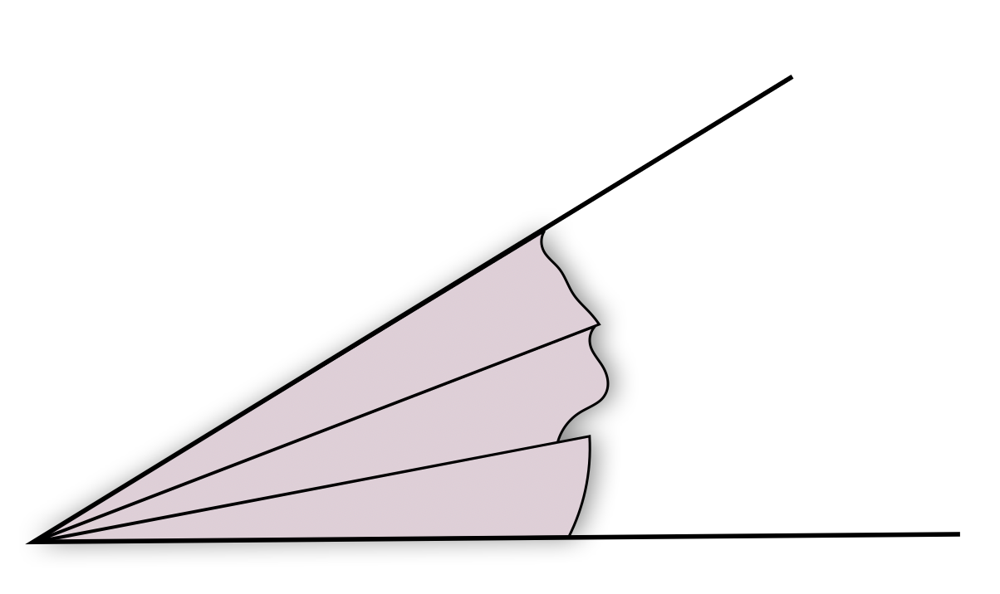
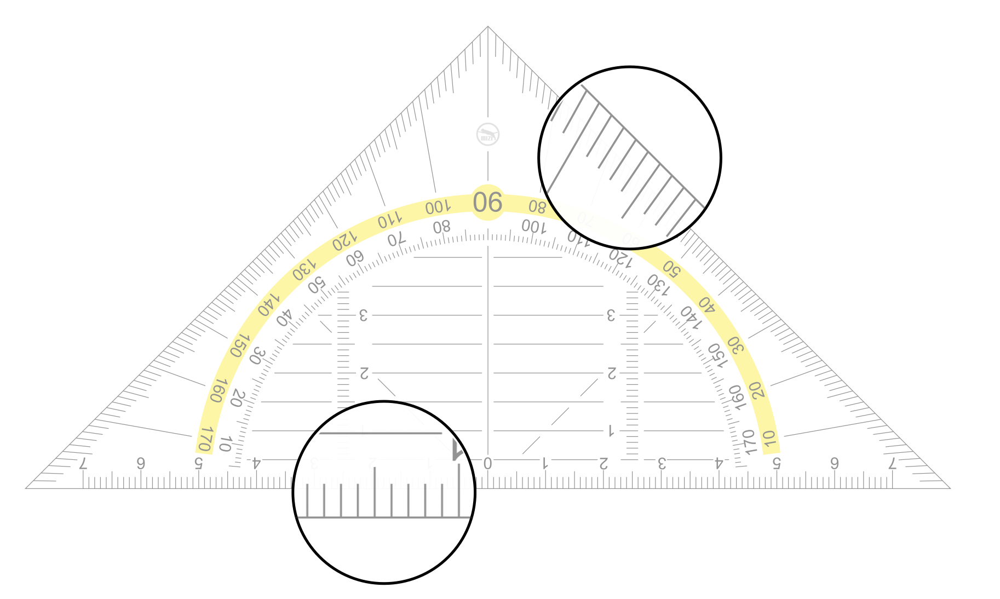

# Leitidee Größen und Messen

> **Material**
>
> + Folien zur Vorlesung zur Leitidee Größen und Messen ([pdf](files/Stoffdidaktik-WiSe2223-Kap11.pdf), [Keynote](files/Stoffdidaktik-WiSe2223-Kap11.key))
> + Kopiervorlage zur Winkelscheibe ([pdf](files/Stoffdidaktik-WiSe2223-Kap11-Winkelscheibe.pdf), [svg](files/Stoffdidaktik-WiSe2223-Kap11-Winkelscheibe.svg))
> + Virtuelles Arbeitsmittel zu arithmetischem Mittel und Median ([html](files/Stoffdidaktik-WiSe2223-Kap11-Lagemasse.html), [Cinderella](files/Stoffdidaktik-WiSe2223-Kap11-Lagemasse.cdy))
> + Virtuelles Arbeitsmittel zum Boxplot ([html](files/Stoffdidaktik-WiSe2223-Kap11-Boxplot.html), [Cinderella](files/Stoffdidaktik-WiSe2223-Kap11-Boxplot.cdy))
>
> **Literaturempfehlungen**
>
> - siehe [Leitidee Raum und Form](#leitidee-raum-und-form)  
> - @Buchter2018: *mathematik lehren 210: Messen*

## Strukturierung der Leitidee {#strukturierung-der-leitidee-groessen-und-messen}

Dokument | Bezeichnung der Leitidee 
:----|:----
Bildungsstandards Primarbereich (2005) | Größen und Messen
Bildungsstandards Primarbereich (2022) | Größen und Messen
Bildungsstandards Mittlerer Schulabschluss (2004) | Messen
Bildungsstandards Erster und Mittlerer Schulabschluss (2022) | Größen und Messen
Rahmenlehrplan Brandenburg, Jahrgangsstufen 1 -- 10 | Größen und Messen
Bildungsstandards Allgemeine Hochschulreife (2012) | Messen
Rahmenlehrplan Brandenburg, Gymnasiale Oberstufe | Messen

Table: (\#tab:bezeichnung-zahl) Bezeichnungen der Leitidee Größen und Messen


<!-- In den Bildungsstandards für den Primarbereich lautet diese Leitidee »Größen und Messen« [@KMK2005 11]. -->

Abbildung \@ref(fig:KonzeptMessen) zeigt das vom @LISUMf herausgegebene Konzeptbild zur Leitidee Größen und Messen die Jahrgangsstufen 1 -- 10, das ebenfalls durch einen didaktischen Kommentar von @Kortenkampb und Materialien zur Diagnose und Förderung [@LISUMe] ergänzt wurde.

(ref:citeKonzeptMessen) Konzeptbild zur Leitidee *Größen und Messen* [@LISUMf]

```{r KonzeptMessen, echo=FALSE, fig.cap="(ref:citeKonzeptMessen)", fig.align='center', out.width='100%'}
knitr::include_graphics("pictures/11-KonzeptMessen.png")
```

Aus diesen Materialien sowie den Beschreibungen in den Bildungsstandards für die Sekundarstufen [@SekretariatderStandigenKonferenzderKultusministerderLanderinderBundesrepublikDeutschland2022 {17 f.}; @KMK:2012 {19}] lassen sich folgende bedeutsame Lerngegenstände ableiten:

> **Bedeutsame Lerngegenstände**
>
> - Messens als Vergleichen mit (Standard-)Einheiten bei Längen, Flächeninhalten und Volumina
> - Einheiten von Größen (insbesondere für Zeit, Masse, Geld, Länge, Fläche, Volumen und Winkel)
> - Schätzen von Größen
> - Flächeninhalt und Umfang von Rechteck, Dreieck und Kreis sowie daraus zusammengesetzten Figuren
> - Volumen und Oberflächeninhalt von Prisma, Pyramide, Zylinder, Kegel und Kugel sowie daraus zusammengesetzten Körpern
> - Berechnen von Streckenlängen und Winkelgrößen mittels Satz des Pythagoras, trigonometrischer Beziehungen und Ähnlichkeitsbeziehungen
> - Skalarprodukt
> - Abstände zwischen Punkten, Geraden und Ebenen
> - Sekanten- und Tangentensteigungen an Funktionsgraphen
> - Änderungsraten
> - Inhalte von Flächen, die durch Funktionsgraphen begrenzt sind
> - Volumen von Rotationskörpern
> - Bestände aus Änderungsraten und Anfangsbestand
> - Lage- und Streumaße einer Stichprobe
> - Erwartungswert und Standardabweichung diskreter Zufallsgrößen


Bereits im [ersten Intermezzo](#erstes-intermezzo-flaecheninhalt) wurde die Idee des Messens am Beispiel des Flächeninhalts dargestellt. Im Folgenden sollen am Beispiel des Winkels sowie an Lage- und Streumaßen einzelne Elemente der Leitidee Größen und Messen diskutiert werden. Während beim Winkel der Schwerpunkt auf der Nutzung von Messinstrumenten liegt, sollen bei Lage- und Streumaßen insbesondere digitale Arbeitsmittel und deren Nutzung in Lernumgebungen betrachtet werden. 

## Winkelgrößen

Im Abschnitt \@ref(beispiel-winkelbegriff) wurde eine kurze stoffdidaktische Analyse zum Winkelbegriff vorgestellt und in Abschnitt \@ref(komplexe-handlungen) die Unterstützung einzelner Lernhandlungen mithilfe des Arbeitsmittels *Winkel-Farm* diskutiert. 

Aus den beiden Abschnitten ist bereits bekannt, dass der Winkelbegriff eine hohe Vorstellungsvielfalt aufweist (Winkel als Knick, als Feld, als Richtungsänderung und als Umdrehung). Dies beeinflusst letztlich auch den Messprozess, da verschiedene Vorstellungen unterschiedliche Messprozesse fordern bzw. unterstützen. Während bspw. bei der Feld-Vorstellung ein direkter Vergleich zwischen Winkelfeldern angebracht ist [siehe @Etzold2021 {88 f.}], bietet sich bei der Richtungsänderung-Vorstellung eher eine dynamische Sichtweise der Änderung eines Schenkels in Richtung des anderen Schenkels an. Die Vorstellungsvielfalt führt also einerseits zu verschiedenen Messverfahren, andererseits ist sie auch notwendig, um Messprozesse ganzheitlich vorstellungsbasiert zu verinnerlichen.

Bevor konkrete Messverfahren diskustiert werden, soll noch auf eine sprachliche Komponente eingegangen werden. Aus fachlicher Perspektive ist es notwendig, **zwischen *Winkeln* und *Winkelgrößen* zu unterscheiden**, um klar zu machen, dass es sich bei einem *Winkel* um ein geometrisches Objekt handelt, dem dann ein Maß, die *Winkelgröße*, zugeordnet wird [vgl. auch @Filler2011 {32}]. Der Rahmenlehrplan von Brandenburg nimmt diese Unterscheidung ebenfalls vor [siehe z. B. @MinisteriumfurBildungJugendundSportdesLandesBrandenburg2015a 42]. In der Unterrichtssprache wird diese Unterscheidung oftmals vernachlässigt, etwa bei der Aufgabenstellung *»Bestimme den Winkel!«*, die korrekterweise *»Bestimme die Größe des Winkels!«* lauten müsste. Als Lehrkraft sollten Sie hier, angepasst an die Lerngruppe, sensibel gegenüber solchen Formulierungen sein.


Entsprechend der Idee des Messens (siehe grüne Felder in Abbildung \@ref(fig:KonzeptMessen)) bieten sich folgende Schritte bei der Bestimmung von Winkelgrößen an, wie sie auch schon am Beispiel des Flächeninhalts in Kapitel \@ref(erstes-intermezzo-flaecheninhalt) dargestellt wurden:

**1. Direktes Vergleichen und Ordnen**

Der erste Schritt des Messens ist der direkte Größenvergleich zwischen zwei Objekten. Dies ist insbesondere mit Winkelfeldern gut zu realisieren, indem deren Scheitelpunkte übereinandergelegt und die Felder geeignet ausgerichtet werden, sodass ein direkter Vergleich möglich ist. 

Beim direkten Vergleich ist noch keine Quantifizierung der Winkelgröße notwendig, jedoch besteht bereits eine Ordnungsrelation. Das bedeutet, dass mehrere Winkel nun auch ihrer Größe nach sortiert werden können bzw. Winkel größer oder kleiner gemacht werden können.

Ein typisches Arbeitsmittel hierfür ist die **Winkelscheibe**, bestehend aus zwei verschiedenfarbigen Papierkreisscheiben, die jeweils durch einen Halbschlitz ineinander gesteckt werden (siehe Abbildung \@ref(fig:Winkelscheibe)). Dabei sollte zunächst auf Skalierungen verzichtet werden, später können diese aufgegriffen und auch Bezüge zu Brüchen als Anteile des Vollwinkels hergestellt werden. 
Die Winkelscheibe steht auch als [Kopiervorlage](files/Stoffdidaktik-WiSe2223-Kap11-Winkelscheibe.pdf) zur Verfügung.


```{r Winkelscheibe, echo=FALSE, fig.cap="Winkelscheibe mit Skalierung", fig.align='center', out.width='50%'}
knitr::include_graphics("pictures/11-Winkelscheibe.png")
```


Eine typische Schwierigkeiten für Schülerinnen und Schüler ist an dieser Stelle, dass es sich bei dem Winkelfeld um einen unendlich ausgedehnten Teilbereich der Ebene handelt. Mit der Erfahrung der Flächeninhaltsmessung könnte dies zu der Fehlvorstellung führen, *Winkelfelder seien unendlich groß*. Es muss also deutlich gemacht werden, dass die **Winkelgröße kein Flächeninhalt** ist, sondern vielmehr eine Aussage über die **Öffnungsweite** des Winkels trifft. @Dohrmann2018 [22] stellt dies am Bezug zur Längenmessung dar: »Analog verhält es sich bei einer Strecke: Auch da ist die Mächtigkeit der im entsprechenden Intervall befindlichen Punkte nicht finit (sondern überabzählbar unendlich). Doch die Winkelmessung verlang eben nicht die Messung der Mächtigkeit der Punktmenge -- in dem Sinne wären alle Winkelfelder gleichmächtig -- sondern die Bestimmung der *Spannweite* durch die begrenzenden Schenkel (so wie die Längenmessung einer Strecke die Weite der Begrenzungspunkte verlangt).«


**2. Auslegen mit einem Vergleichsmaß**

Im nächsten Schritt werden Winkel mithilfe von Vergleichswinkeln ausgelegt.^[Hierzu noch einige Hinweise: Beim Auslegen ist relevant, dass dies *mathematisch korrekt* durchgeführt wird, also die Scheitelpunkte der Keile identisch sind und die Schenkel plan aneinander gelegt werden. Dieses Vorgehen ist zwar intuitiv richtig zu erwarten, aber dennoch nicht trivial (oder gar mathematisch selbstverständlich). Hierbei wird gleichzeitig über die Auslegehandlung ein Verständnis zum Winkelbegriff (in der Feld-Vorstellung) ausgebildet bzw. aufgerufen. Dieses Verständnis spielt dann auch eine Rolle beim Addieren von Winkelgrößen. Das (korrekte) Hintereinanderlegen der als *Lernmittel* aufzufassenden Winkelkeile ist eine *Lernhandlung*, deren Verallgemeinerung und Verinnerlichung eine Vorstellung zum Addieren von Winkelgrößen ausbildet.] Hierzu bieten sich **gleich große Winkelkeile** an. Dies ermöglicht nun eine erste Quantifizierung, ähnlich wie bei Flächeninhalt mit bekannten Vergleichmaßen (z. B. Fußballfelder) argumentiert wird. Abbildung \@ref(fig:Winkelauslegen) zeigt ein derartiges Auslegen.


```{r Winkelauslegen, echo=FALSE, fig.cap="Auslegen eines Winkels mit Winkelkeilen", fig.align='center', out.width='50%'}

```
Dieses Vorgehen kann weiteren typischen Fehlvorstellungen entgegentreten, nämlich dass die Größe eines Winkels abhängig wäre von der Schenkellänge und von der Lage des Winkels in der Ebene. Zum Abbau der Fehlvorstellung trägt weiterhin bei, wenn man die Vergleichskeile unterschiedlich lang gestaltet und ihre Enden verschieden abschneidet bzw. abreißt. So wird deutlich gemacht, dass es tatsächlich nur um die Öffnungsweite geht, wenn man die Größe eines Winkels bestimmen möchte. Dies kann im Übrigen auch bei zwei gleich großen Winkeln veranschaulicht werden (siehe Abbildung \@ref(fig:Winkelkeile)).

```{r Winkelkeile, echo=FALSE, fig.cap="Unterschiedliche Winkelkeile mit demselben Maß", fig.align='center', out.width='50%'}
knitr::include_graphics("pictures/11-Winkelkeile.png")
```

**3. Nutzen von Standardeinheiten und Messinstrument**

Der letzte Schritt ist nun die Einführung einer Standardeinheit und die Nutzung von standardisierten Messinstrumenten. 

Hierbei kann $1°$ als der 360-te Teil eines Vollwinkels definiert werden oder $90°$ als die Größe eines rechten Winkels. Ersteres ist die mathematisch übliche Herangehensweise, bedarf aber einer vorherigen Vorstellung des Vollwinkels. Der rechte Winkel dagegen ist den Schülerinnen und Schülern in der Regel schon länger bekannt und über die zueinander senkrechten Schenkeln besser greifbar. Wenn bsp. ein rechter Winkel zuvor mit neun $10°$-Keilen ausgelegt worden ist, kann so schrittweise über eine Verfeierung dieser Keile in 10 gleich große Teile die Winkelgröße von $1°$ definiert werden.

Übliche Messgeräte sind das Geodreieck, der Winkelmesser (als Halb- oder Vollkreiswinkelmesser) oder auch das Goniometer. 

Das **Geodreieck** ist insofern problematisch, als dass seine (unkritische) Verwendung zu einer Verwechslung von Winkelgrößen und Streckenlängen führen kann. In einer Studie von @Dohrmann2014 [{303 f.}] haben etwa 10 % der Schülerinnen und Schüler die Vorstellung geäußert, $1°$ sei so groß wie $1\,\mathrm{mm}$. Wendet man die im Abschnitt \@ref(analyseschritte) dargestellten Schritte zur Analyse eines Arbeitsmittels hierauf an, wäre für diese Fehlvorstellung ein tätigkeitstheoretischer Erklärungsansatz, dass sowohl beim Messen eines Winkels als auch beim Messen einer Strecken dieselbe *Operation* mit demselben *Arbeitsmittel* durchgeführt wird (nämlich das Ablesen der Skala am geradlinig verlaufenden Rand des Geodreiecks, siehe Abbildung \@ref(fig:Geodreieck)). Damit verbinden die Schülerinnen (fälschlicherweise) dieselbe mathematische Handlung, sehen also das Winkelmessen als dasselbe an wie das ihnen bereits bekannte Streckenmessen [vgl. auch @Dohrmann2018b {450 f.}].

(ref:citeGeodreieck) Längen- und Winkelmessung mit dem Geodreieck (Original-Geodreieck: Michael Zimmermann, Public domain, via Wikimedia Commons, https://commons.wikimedia.org/wiki/File:Set_square_Geodreieck.svg)

```{r Geodreieck, echo=FALSE, fig.cap="(ref:citeGeodreieck)", fig.align='center', out.width='75%'}

```


Zum Einstieg des Winkelmessen sollte aus dieser Perspektive daher auf das Geodreieck verzichtet werden. Stattdessen können **Winkelmesser** benutzt werden, die keinen oder einen optisch zumindest abgrenzenden Bezug zur Längenmessung haben (letzteres etwa bei Halbkreiswinkelmessern, die mit Linealen kombiniert sind). Winkel können dabei durch Anlegen und Ablesen gemessen werden oder über Anlegen, Drehen und anschließendem Ablesen (siehe Abbildung \@ref(fig:Winkelmesser)). Die Methoden unterstützen in unterschiedlicher Weise eine statische bzw. dynamische Sichtweise auf Winkel und sollten daher beide eingeführt werden. Beide Vorgehen sind übrigens auch mit dem Geodreieck möglich, vgl. @Dohrmann2018 [21].


```{r Winkelmesser, echo=FALSE, fig.cap="Statisches und dynamisches Vorgehen mit einem Winkelmesser", fig.align='center', out.width='90%'}
knitr::include_graphics("pictures/11-Winkelmesser.png")
```


Im Unterricht sollte dabei auf jeden Fall thematisiert werden, dass das Verlängern (oder Einkürzen) der Schenkel nicht das Maß des Winkels beeinflusst. Dies ist sogar auch teilweise als Vorgehensstrategie notwendig, wenn bspw. ein Schenkel des Winkels zu kurz ist, um seine Größe am Winkelmesser ablesen zu können.

Ein im deutschsprachigen Mathematikunterricht kaum verbreitetes Arbeitsmittel zum Winkelmessen ist das **Goniometer**, siehe Abbildung \@ref(fig:Goniometer). Dieses weist jedoch die Stärke auf, dass hier die Messhandlung nun eine deutlich andere ist als die beim Streckenmessen. Weiterhin kann der dynamische Charakter und das Identifizieren von Scheitelpunkt und Schenkel in besonderer Weise hervorgehoben werden. Weitere Hinweise zur Nutzung finden Sie bei @Dohrmann2018 [22].

```{r Goniometer, echo=FALSE, fig.cap="Goniometer", fig.align='center', out.width='75%'}
knitr::include_graphics("pictures/11-Goniometer.png")
```

<!-- Sowohl für die [Winkelscheibe](files/Stoffdidaktik-WiSe2223-Kap11-Winkelscheibe.pdf) als auch für das Goniometer finden Sie oben bei den Materialien entsprechende Druckvorlagen. -->


## Lage- und Streumaße

In den Bildungsstandards für den Mittleren und Ersten Schulabschluss sind Lage- und Straumaße nicht Bestandteil der Leitidee, sondern als Kenngrößen in der Leitidee Daten und Zufall enthalten. Allerdings sind sie in den Bildungsstandards für die Allgemeine Hochschulreife in der Leitidee Messen dargestellt -- und auch fachlich wie begrifflich lassen sie sich dort einordnen.

An dieser Stelle sollen einige virtuelle Arbeitsmittel betrachtet werden, die eine operative Auseinandersetzung mit Lage- und Streumaßen ermöglichen.


Zur Erkundung von **arithmetischem Mittel** und **Median** erstellt bietet sich das in Abbildung \@ref(fig:ScreenshotLagemass) dargestellte [virtuelle Arbeitsmittel](files/Stoffdidaktik-WiSe2223-Kap11-Lagemasse.html) an.

```{r ScreenshotLagemass, echo=FALSE, fig.cap="Screenshot des virtuellen Arbeitsmittels zu Lagemaßen", fig.align='center', out.width='75%'}
knitr::include_graphics("pictures/11-ScreenshotLagemass.png")
```

Auf einer skalierten Achse sind dabei Punkte markiert und es wird das arithmetische Mittel (gelb) sowie der Median (blau) dargestellt. Die Punkte können verschoben werden und es ist möglich, neue Punkte hinzuzufügen bzw. existierende Punkte zu entfernen, wobei sich arithmetisches Mittel und Median automatisiert anpassen. Die folgenden Aufgabenstellungen zeigen exemplarisch, wie ein derartiges Arbeitsmittel genutzt werden kann, um Schülerinnen und Schüler zum operativen Durcharbeiten bezüglich dieser Lagemaße anzuregen: 

* *Verändere die Punkte so, dass Median und arithmetisches Mittel gleich sind.*
* *Kannst du Punkte verschieben, so dass Median oder arithmetisches Mittel unverändert bleiben? Bei welchen Punkten geht das (nicht) und warum (nicht)?*
* *Wie verändert sich das beobachtete Verhalten von arithmetischem Mittel und Median bei ungerader Anzahl an Punkten?*
* *Zeige mit dem Arbeitsmittel, dass der Median stabil gegenüber Ausreißern ist, das arithmetische Mittel jedoch nicht.*


Der **Median** und die **Spannweite** sowie **oberes und unteres Quartil** spielen eine bedeutsame Rolle beim Erstellen von Boxplots. Abbildung \@ref(fig:ScreenshotBoxplot) zeigt den Screenshot eines [virtuellen Arbeitsmittels](files/Stoffdidaktik-WiSe2223-Kap11-Boxplot.html) zur Erkundung von Zusammenhängen am Boxplot, das im Rahmen einer Masterarbeit an der Universität Potsdam entstanden ist [@Korn2023].

```{r ScreenshotBoxplot, echo=FALSE, fig.cap="Screenshot des virtuellen Arbeitsmittels zum Boxplot", fig.align='center', out.width='75%'}
knitr::include_graphics("pictures/11-ScreenshotBoxplot.png")
```

Auch bei diesem Arbeitsmittel wird der Boxplot abhängig von der Lage der variierbaren Punkte automatisiert dargestellt. Über weitere Konfigurationen wie das Einblenden des Datensatzes oder das Ausblenden der Daten selbst können vielfältige Aufgaben bearbeitet werden [vgl. @Korn2023]:

* *Verändere den Datensatz so, dass*
  - *die Box kleiner wird,*
  - *die linke Antenne ganz lang und die rechte Antenne ganz kurz wird,*
  - *die rechte Hälfte der Box größer wird, aber der Median gleich bleibt.*
* *Erstelle einen eigenen Datensatz, blende ihn aus und lass deinen Partner bzw. deine Partnerin einen passenden Datensatz mit mindestens neun Werten finden, der denselben Boxplot produziert.*


