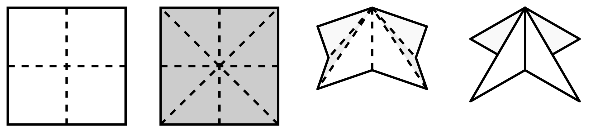
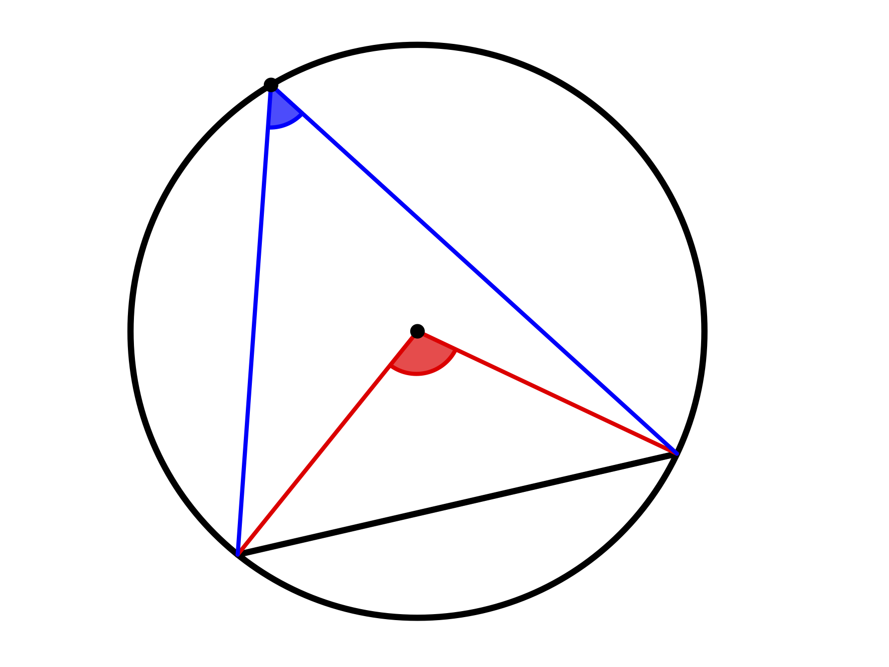
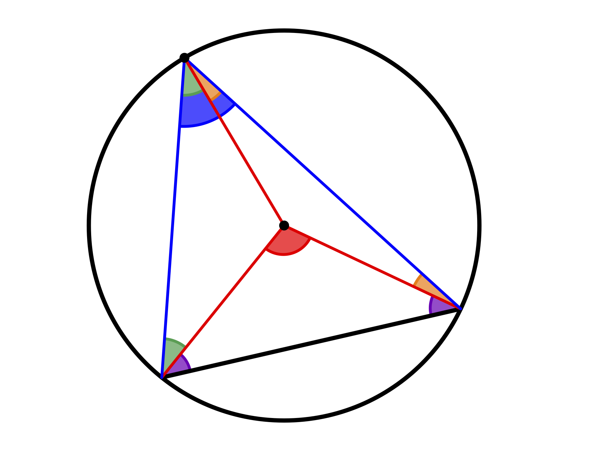

# Leitidee Raum und Form

## Strukturierung der Leitidee {#strukturierung-der-leitidee-raum-und-form}

> **Material**
>
> + Folien zur Vorlesung zur Leitidee Raum und Form ([pdf](files/Stoffdidaktik-WiSe2223-Kap12.pdf), [Keynote](files/Stoffdidaktik-WiSe2223-Kap12.key))
>
> **Literaturempfehlungen**
>
> - @Franke2016: *Didaktik der Geometrie. In der Grundschule*
> - @Weigand2018: *Didaktik der Geometrie für die Sekundarstufe I*
> - @Henn2015: *Didaktik der Analytischen Geometrie und Linearen Algebra: Algebraisch verstehen -- Geometrisch veranschaulichen und anwenden*
> - @Tietze:2000: *Mathematikunterricht in der Sekundarstufe II. Band 2: Didaktik der Analytischen Geometrie und Linearen Algebra*


Dokument | Bezeichnung der Leitidee 
:----|:----
Bildungsstandards Primarbereich (2005) | Raum und Form
Bildungsstandards Primarbereich (2022) | Raum und Form
Bildungsstandards Mittlerer Schulabschluss (2004) | Raum und Form
Bildungsstandards Erster und Mittlerer Schulabschluss (2022) | Raum und Form
Rahmenlehrplan Brandenburg, Jahrgangsstufen 1 -- 10 | Raum und Form
Bildungsstandards Allgemeine Hochschulreife (2012) | Raum und Form
Rahmenlehrplan Brandenburg, Gymnasiale Oberstufe | Raum und Form

Table: (\#tab:bezeichnung-zahl) Bezeichnungen der Leitidee Raum und Form

Auch zur Leitidee Raum und Form hat das @LISUM2022 Materialien zur Diagnose und Förderung, einen didaktischen Kommentar sowie ein Konzeptbild für die Jahrgangsstufen 1 -- 10 herausgegeben (siehe Abbildung \@ref(fig:KonzeptRaumForm)).

(ref:citeKonzeptRaumForm) Konzeptbild zur Leitidee *Raum und Form* [@LISUM2022 {23}]

```{r KonzeptRaumForm, echo=FALSE, fig.cap="(ref:citeKonzeptRaumForm)", fig.align='center', out.width='100%'}
knitr::include_graphics("pictures/12-KonzeptbildRaumForm.png")
```

Mit den Beschreibungen in den Bildungsstandards für die Sekundarstufen [@SekretariatderStandigenKonferenzderKultusministerderLanderinderBundesrepublikDeutschland2022 {20 f.}; @KMK:2012 {19}] ergeben sich folgende bedeutsame Lerngegenstände:

> **Bedeutsame Lerngegenstände**
>
> - geometrische Objekte (Punkte, Winkel, Strecken, Geraden, Flächen, Körper) 
> - Beziehungen geometrischer Objekte (z. B. Symmetrie, Idee der Kongruenz, Ähnlichkeit, Lagebeziehungen) 
> - Operieren im zwei- und dreidimensionalen Raum (z. B. verschieben, drehen, spiegeln)
> - Darstellen ebener geometrischer Figuren (z. B. Dreiecke, Vierecke) und elementarer geometrischer Abbildungen (z. B. Verschiebungen, Drehungen, Spiegelungen, zentrische Streckungen) im ebenen kartesischen Koordinatensystem
> - Netze, Schrägbilder und Modelle ausgewählter Körper (z. B. Prisma, Pyramide)
> - Analysieren und Klassifizieren geometrischer Objekte der Ebene (insbesondere Winkel, Dreiecke, Vierecke) und des Raumes (insbesondere Prismen, Pyramiden, Zylinder, Kegel, Kugel)
> - Sätze der ebenen Geometrie (insbesondere Satz des Pythagoras, Satz des Thales, Ähnlichkeitsbeziehungen und trigonometrische Beziehungen) 
> - Zeichnen und Konstruieren geometrischer Figuren 
> - Untersuchung der Lösbarkeit und Lösungsvielfalt von Konstruktionsaufgaben
> - Koordinatisieren geometrischer Sachverhalte in Ebene und Raum
> - Vektoren
> - Geometrische Deutung des Skalarprodukts
> - Analytische Beschreibung von Geraden und Ebenen sowie deren Lagebeziehungen 

Über Falthandlungen soll im Folgenden dargestellt werden, wie auf enaktive Weise Lagebeziehungen von Punkten, Gerade und Ebenen anschaulich im Mathmatikunterricht behandelt werden können. Weiterhin werden exemplarisch an einigen elementargeometrischen Sätzen Argumentations- und Beweisanlässe diskutiert, die sich im Geometrieunterricht der frühen Sekundarstufe anbieten.

## Lagebeziehungen

Lagebeziehungen zwischen Punkten, Geraden und Ebenen spielen über die gesamte Schullaufbahn eine bedeutsame Rolle. Es beginnt in der Grundschule über die Lage von Punkten auf Geraden, zueinander senkrechte und parallele Geraden, den Winkelbegriff zu Beginn der Sekundarstufe, bis hin zur Analytischen Geometrie in der Sekundarstufe II, wenn die Lagebeziehungen algebraisch beschrieben werden. An dieser Stelle sollen einige grundlegende Gedanken dargstellt und mit enaktiven Erfahrungen in Bezug gebracht werden.

### Lagebeziehungen falten

Werden auf einem Blatt Papier zwei Punkte markiert und dieser aufeinandergefaltet, entsteht als Faltlinie die Mittelsenkrechte zwischen diesen beiden Punkten (siehe Abbildung \@ref(fig:Mittelsenkrechte)). 

(ref:citeMittelsenkrechte) Mittelsenkrechte durch Faltung [@Etzold2014a 5]

```{r Mittelsenkrechte, echo=FALSE, fig.cap="(ref:citeMittelsenkrechte)", fig.align='center', out.width='75%'}
knitr::include_graphics("pictures/12-Mittelsenkrechte.png")
```

Um dies zu begründen, muss die Faltung analysiert und mit der geometrischen Konfiguration in Zusammenhang gebracht werden. Betrachtet man einen Punkt $C$ auf der Faltlinie, so hat dieser zu $A$ und $B$ denselben Abstand, was aus dem Übereinanderlegen von $A$ und $B$ durch die Faltung bekommt. Die Faltlinie ist damit die Menge aller Punkte (in der Ebene des Papierstücks), die zu $A$ und $B$ denselben Abstand haben -- und dies ist gerade die *Mittelsenkrechte*. 

Lerntheoretisch kann als **Lernhandlung** das *Erkennen* (als mehrfaches *Identifizieren* und *Realisieren*) der geometrischen Konfiguration der Faltung aufgefasst werden (vgl. typische Lernhandlungen im Mathematikunterricht in Abschnitt \@ref(typische-lernhandlungen)). Die **Analyse dieser Lernhandlungen** führt nun zur Aneignung geometrischen Wissens. 

Fachdidaktisch interessant ist hier die Betonung der **Ortslinieneigenschaft** der Mittelsenkrechten. Diese Abstandsbedingung zu zwei Punkten ist auch relevant, um die Konstruktion einer Mittelsenkrechten durchzuführen -- also das Zeichnen zweier Kreisbögen mit demselben Radius von den Punkten ausgehend, die Schnittpunkte liegen dann auf der Mittelsenkrechten. Auch wenn begründet werden soll, dass sich die Mittelsenkrechten der Seiten eines Dreiecks im Umkreismittelpunkt schneiden, bedarf es dieser Eigenschaft. Aus dem Bezeichner *Mittelsenkrechte* ist die entsprechende Eigenschaft dagegen nicht direkt ablesbar -- handelt es sich demnach doch »nur« um eine Gerade, die senkrecht zur Strecke $\overline{AB}$ und durch deren Mitte verläuft.^[Im Übrigen sind beide Eigenschaften äquivalent zueinander -- es lohnt sich, den Beweis dafür einmal durchzuführen.] 

Der Faltprozess kann also eine Motivation bieten, über eine zunächst enaktive Handlung die geometrische Eigenschaft der Faltprodukte genauer zu betrachten und die Faltung selbst »auseinanderzunehmen«. Ein solcher Analyseprozess kann nochmal verstärkt gefordert werden, wenn bspw. das Faltergebnis in einer **Dynamischen Geometriesoftware** (DGS) realisiert wird. Dann nämlich ist es notwendig, die Faltlinie über die im DGS zur Verfügung stehenden Werkzeuge zu realisieren [vgl. @Etzold2014a 6].

In analoger Weise zur Faltung der Mittelsenkrechten durch Punkt-auf-Punkt-Faltung kann auch das Falten einer Winkelhalbierenden durch Kante-auf-Kante-Faltung realisiert werden. Darauf aufbauend wiederum können Senkrechten, Parallelen oder sogar Quadrate bzw. Kreismittelpunkte gefaltet werden [siehe @Etzold2014a {10, 82 f., 86 f.}].


### 3D-Koordinatensystem

Aus 6 quadratischen Blättern lässt sich ein Oktaeder basteln, wenn man die Blätter entsprechend Abbildung \@ref(fig:3DKos1) faltet und entsprechend Abbildung \@ref(fig:3DKos2) ineinander steckt.

(ref:cite3DKos1) Faltung für einen Oktaeder [@Etzold2014a 64]

```{r 3DKos1, echo=FALSE, fig.cap="(ref:cite3DKos1)", fig.align='center', out.width='75%'}

```

(ref:cite3DKos2) Zusammenfügen zum Oktaeder [@Etzold2014a 64]

```{r 3DKos2, echo=FALSE, fig.cap="(ref:cite3DKos2)", fig.align='center', out.width='75%'}
knitr::include_graphics("pictures/12-3DKos2.png")
```

Dieser Oktaeder kann nun als dreidimensionales Koordinatensystem aufgefasst werden (siehe Abbildung \@ref(fig:3DKos3)).


(ref:cite3DKos3) Dreidimensionales Koordinatensystem [@Etzold2014a 65]

```{r 3DKos3, echo=FALSE, fig.cap="(ref:cite3DKos3)", fig.align='center', out.width='50%'}
knitr::include_graphics("pictures/12-3DKos3.png")
```

An diesem lassen sich vielfältige Aufgaben zur Koordinatengeometrie in der Sekundarstufe II veranschaulichen, zum Beispiel [vgl. @Etzold2014a 65]:

* *Spanne mit Nadel und Faden eine Strecke von $(2|0|0)$ nach $(0|3|0)$. Gib die Gleichung der Geraden $g$ an, auf der diese Strecke liegt.*

* *Spanne mit Nadel und Faden eine beliebige Strecke, die parallel zu $g$ liegt. Gib deren Gleichung an.*

* *Stecke mit dem Zahnstocher eine Strecke, die senkrecht zu $g$ liegt.*

An dieser Stelle wird jedoch nicht mehr die durchgeführte Falthandlung geometrisch analysiert, sondern das gefaltetes Objekt dient lediglich als **Visualisierungsobjekt** -- in dem Fall für das dreidimensionale Koordinatensystem.


## Elementargeometrische Sätze

Elementargeometrische Sätze bieten eine gute Möglichkeit, Argumentieren und Beweisen auf verschiedenen Niveaus im Mathematikunterricht zu realisieren. Am Beispiel des Innenwinkelsatzes für Dreiecke und anhand von Sätzen am Kreis wird dies im Folgenden dargestellt.

### Innenwinkelsatz für Dreiecke

Dass die Innenwinkelsumme von (ebenen) Dreiecken stets $180°$ beträgt, lässt sich auf verschiedene Weisen plausibel machen und begründen.

Zunächst einmal ist es möglich, die Innenwinkel tatsächlich **auszumessen und ihre Größen zu addieren**. Dies ist besonders dann überzeugend, wenn die Schülerinnen und Schüler selbst ein beliebiges Dreieck zeichnen und daran ihre Messungen vornehmen. Aufgrund von Messungenauigkeiten wird es ggf. vorkommen, dass die Summe nicht exakt $180°$ beträgt, aber immerhin sollten sich alle Innenwinkelsummen in diesem Bereich bewegen. Ein nächster Schritt könnte die Nutzung **Dynamischer Geometriesoftware** sein, wo die Messungen und die Summe exakter bestimmt werden können. Dabei überzeugt weiterhin die Möglichkeit, das Dreieck selbst zu variieren und simultan zu erkennen, dass sich zwar die Größen der drei Innenwinkel ändern, nicht jedoch ihre Summe.

Auf enaktiver Ebene sind das **Abreißen von Ecken**^[Es ist darauf zu achten, dass wirklich *gerissen* und nicht *geschnitten* wird, weil sonst nicht mehr erkennbar ist, was die eigentliche Ecke war.] oder das **Aneinanderlegen zueinander kongruenter Dreiecke** mögliche Herangehensweisen, um einen gestreckten Winkel von $180°$ zu erzeugen (siehe Abbildung \@ref(fig:InnenwinkelReissen)).


(ref:citeInnenwinkelReissen) Innenwinkelsumme enaktiv bestimmen [@Etzold2014a 32]

```{r InnenwinkelReissen, echo=FALSE, fig.cap="(ref:citeInnenwinkelReissen)", fig.align='center', out.width='75%'}
knitr::include_graphics("pictures/12-InnenwinkelReissen.png")
```


Gegenüber dem Messen und Rechnen hat dieses Vorgehen, insbesondere das Aneinanderlegen, die Besonderheit, dass daran schon eine allgemeine Beweisidee sichtbar wird. Dies ist auch der Fall, wenn man einen **Stift im Inneren des Dreiecks wandern** lässt. Dieser hat dann, wenn er alle Ecken einmal abgelaufen ist, insgesamt eine halbe Drehung (also um $180°$) vollführt (siehe Abbildung \@ref(fig:InnenwinkelStift)).


```{r InnenwinkelStift, echo=FALSE, fig.cap="Innenwinkelsumme mit Stiftbewegung erfahren", fig.align='center', out.width='50%'}
knitr::include_graphics("pictures/12-InnenwinkelStift.gif")
```

Für den eigentlichen Beweis kann man parallel zu einer Dreiecksseite einen Gerade durch den gegenüberliegenden Punkt zeichnen (siehe Abbildung \@ref(fig:InnenwinkelBeweisfigure)) und den gestreckten Winkel von $180°$ mithilfe des Wechselwinkelsatzes begründen.


```{r InnenwinkelBeweisfigure, echo=FALSE, fig.cap="Beweisfigur des Innenwinkelsatzes für Dreiecke", fig.align='center', out.width='75%'}
knitr::include_graphics("pictures/12-InnenwinkelBeweisfigur.png")
```

### Sätze am Kreis

#### Zentri-Peripheriewinkelsatz

Der Zentri-Peripheriewinkelsatz besagt, dass der Zentriwinkel über der Sehne eines Kreises stets doppelt so groß ist wie ein Peripheriewinkel auf derselben Seite derselben Sehne (siehe Abbildung \@ref(fig:Zentri)).

```{r Zentri, echo=FALSE, fig.cap="Zentriwinkel (rot) und Peripheriewinkel (blau) auf derselben Seite über derselben Kreissehne", fig.align='center', out.width='75%'}

```


Um diesen Satz zu beweisen, bedarf es vielfältiger Heurismen, wie das Zeichnen geeigneter Hilfslinien (Radius), die Bezugnahme auf bekannte Sätze (Basiswinkelsatz im gleichschenkligen Dreieck, Innenwinkelsatz im Dreieck) und das Erkennen der Gleichheit von Termen.


```{r ZentriBeweis, echo=FALSE, fig.cap="Beweisfigur des Zentri-Peripherwiewinkelsatzes", fig.align='center', out.width='75%'}

```

Mit den Farben der Winkel aus Abbildung \@ref(fig:ZentriBeweis) gilt dann in den jeweiligen Dreiecken:

$$
\begin{aligned}
2\cdot \mathrm{\color{green}{grün}} + 2\cdot \mathrm{\color{orange}{orange}} + 2\cdot \mathrm{\color{purple}{lila}}  &= 180°\\
 \mathrm{\color{red}{rot}} + 2\cdot \mathrm{\color{purple}{lila}} &= 180°
\end{aligned}
$$

Daraus folgt aus dem Vergleich der beiden Zeilen direkt die Aussage des Satzes:

$$\begin{aligned}
\mathrm{\color{red}{rot}} &= 2\cdot \mathrm{\color{green}{grün}} + 2\cdot \mathrm{\color{orange}{orange}} \\
\mathrm{\color{red}{rot}} &= 2\cdot (\mathrm{\color{green}{grün}} +  \mathrm{\color{orange}{orange}}) \\
\mathrm{\color{red}{rot}} &= 2\cdot \mathrm{\color{blue}{blau}}
\end{aligned}
$$
Da der Satz selbst für den weiteren Schulunterricht keine so hohe Bedeutung hat, müssen Sie als Lehrkraft besonders abwägen, ob Sie diesen Beweis besprechen wollen -- auch abhängig von Ihrer Lerngruppe. Im Sinne der Schulung von Heurismen in der Geometrie hat er aber durchaus Potenzial.

#### Peripheriewinkelsatz

Der Peripheriewinkelsatz besagt, dass alle Peripheriewinkel auf derselben Seite über derselben Sehne eines Kreises gleich groß sind. Eine Erkundung dieses Satzes ist -- wie beim Innenwinkelsatz für Dreiecke -- bspw. mit Dynamischer Geometriesoftware möglich, indem bei Bewegung des Punktes auf dem Kreis der Peripherwiewinkel permanent gemessen wird.

Formal folgt der Satz direkt aus dem Zentri-Peripherwiewinkelsatz, da der Zentriwinkel bei fester Sehne gleich groß bleibt.


#### Satz des Thales

Eine weitere direkte Folgerung aus dem Zentri-Peripherwiewinkelsatz ist der Satz des Thales, also dass Peripheriewinkel über dem Durchmesser eines Kreises stets $90°$ betragen. Dies liegt daran, dass der Zentriwinkel in diesem Fall $180°$ beträgt (siehe Abbildung \@ref(fig:Thales)).

```{r Thales, echo=FALSE, fig.cap="Peripheriewinkel über dem Durchmesser eines Kreises", fig.align='center', out.width='75%'}
knitr::include_graphics("pictures/12-Thales.png")
```

Der Zusammenhang zwischen Satz des Thales und Zentri-Peripherwiewinkelsatz sollte v. a. dann hergestellt werden, wenn der Zentri-Peripherwiewinkelsatz intensiv behandelt worden ist. Alternativ lässt sich der Satz des Thales auch direkt beweisen -- und das ist als Spezielfall sogar einfacher als der Beweis des Zentri-Peripherwiewinkelsatzes. Abbildung \@ref(fig:ThalesBeweis) zeigt einen Lückentext-Beweis, wie er von Schülerinnen und Schülern durchgeführt werden könnte.


(ref:citeThalesBeweis) Lückentext-Beweis des Satz des Thales [@Wennekers2016 173]

```{r ThalesBeweis, echo=FALSE, fig.cap="(ref:citeThalesBeweis)", fig.align='center', out.width='75%'}
knitr::include_graphics("pictures/12-ThalesBeweis.png")
```

