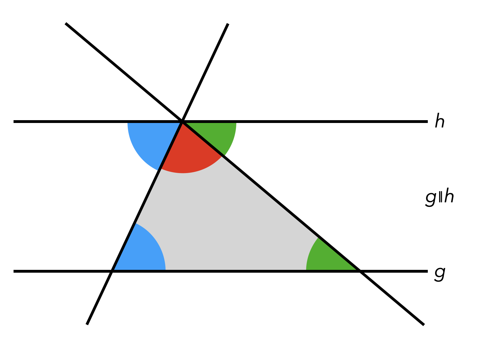

# Leitidee Raum und Form


<!-- > **Bedeutsame Lerngegenstände** -->
<!-- > -->
<!-- > - Punkt, Strecke -->
<!-- > - Dreieck, Viereck -->
<!-- > - Winkel -->
<!-- > - Geometrische Körper -->
<!-- > - Vektor -->
<!-- > - Skalarprodukt -->
<!-- > - Gerade, Ebene -->
<!-- > - Sätze am Kreis -->
<!-- > - Satzgruppe des Pythagoras -->
<!-- >   -->
<!-- > **Literaturempfehlungen**   -->
<!-- >  -->
<!-- > - @Franke2016: *Didaktik der Geometrie. In der Grundschule* -->
<!-- > - @Weigand2018: *Didaktik der Geometrie für die Sekundarstufe I* -->
<!-- > - @Tietze:2000: *Mathematikunterricht in der Sekundarstufe II. Band 2: Didaktik der Analytischen Geometrie und Linearen Algebra* -->


<!-- ## Übersicht zur Geometrie -->

<!-- Im Rahmen der Vorlesung wurde ein Übersichtsbild erstellt, in dem geometrische Objekte (gelb), Relationen (rot), Sätze (blau) und relevante Werkzeuge (grün) in Beziehung zueinander gesetzt werden (siehe Abbildung \@ref(fig:KonzeptRaumForm). Die Übersicht steht auch als [pdf-Datei](files/Stoffdidaktik-WiSe2122-AnhangR-KonzeptRaumForm.pdf) zur Verfügung. -->

<!-- ```{r KonzeptRaumForm, echo=FALSE, fig.cap="Übersicht zur Geometrie", fig.align='center', out.width='75%'} -->
<!-- knitr::include_graphics("pictures/D-KonzeptRaumForm.png") -->
<!-- ```   -->

<!-- Eine derartige Übersicht kann Ihnen bei der stoffdidaktischen Analyse helfen, fachliche Zusammenhänge im Blick zu behalten und Sie in der Spezifizierung und Strukturierung von Lerninhalten zu unterstützen. -->

<!-- ## Elementargeometrische Sätze -->

<!-- Elementargeometrische Sätze bieten eine gute Möglichkeit, Argumentieren und Beweisen auf verschiedenen Niveaus im Mathematikunterricht zu realisieren. -->

<!-- ### Innenwinkelsatz für Dreiecke -->

<!-- Dass die Innenwinkelsumme von (ebenen) Dreiecken stets $180°$ beträgt, lässt sich auf verschiedene Weisen plausibel machen und begründen. -->

<!-- Zunächst einmal ist es möglich, die Innenwinkel tatsächlich **auszumessen und zu addieren**. Dies ist besonders dann überzeugend, wenn die Schülerinnen und Schüler selbst ein beliebiges Dreieck zeichnen und daran ihre Messungen vornehmen. Aufgrund von Messungenauigkeiten wird es ggf. vorkommen, dass die Summe nicht exakt $180°$ beträgt, aber immerhin sollten sich alle Innenwinkelsummen in diesem Bereich bewegen. Ein nächster Schritt könnte die Nutzung **Dynamischer Geometriesoftware** sein, wo die Messungen und die Summe exakter bestimmt werden können. Dabei überzeugt weiterhin die Möglichkeit, das Dreieck selbst zu variieren und simultan zu erkennen, dass sich zwar die Größen der drei Innenwinkel ändern, nicht jedoch ihre Summe. -->

<!-- Auf enaktiver Ebene sind das **Abreißen von Ecken**^[Es ist darauf zu achten, dass wirklich *gerissen* und nicht *geschnitten* wird, weil sonst nicht mehr erkennbar ist, was die eigentliche Ecke war.] oder das **Aneinanderlegen zueinander kongruenter Dreiecke** mögliche Herangehensweisen, um einen gestreckten Winkel von $180°$ zu erzeugen (siehe Abbildung \@ref(fig:InnenwinkelReissen)). -->


<!-- (ref:citeInnenwinkelReissen) Innenwinkelsumme enaktiv bestimmen [@Etzold2014a 32] -->

<!-- ```{r InnenwinkelReissen, echo=FALSE, fig.cap="(ref:citeInnenwinkelReissen)", fig.align='center', out.width='75%'} -->
<!-- knitr::include_graphics("pictures/C-InnenwinkelReissen.png") -->
<!-- ``` -->


<!-- Gegenüber dem Messen und Rechnen hat dieses Vorgehen, insbesondere das Aneinanderlegen, die Besonderheit, dass daran schon eine allgemeine Beweisidee sichtbar wird. Dies ist auch der Fall, wenn man einen **Stift im Inneren des Dreiecks wandern**, der, wenn er alle Ecken einmal abgelaufen ist, insgesamt eine halbe Drehung (also um $180°$) vollführt hat (siehe Abbildung \@ref(fig:InnenwinkelStift)). -->


<!-- ```{r InnenwinkelStift, echo=FALSE, fig.cap="Innenwinkelsumme mit Stiftbewegung erfahren", fig.align='center', out.width='50%'} -->
<!-- knitr::include_graphics("pictures/C-InnenwinkelStift.gif") -->
<!-- ``` -->

<!-- Für den eigentlichen Beweis kann man parallel zu einer Dreiecksseite einen Gerade durch den gegenüberliegenden Punkt zeichnen (siehe Abbildung \@ref(fig:InnenwinkelBeweisfigure)) und den gestreckten Winkel von $180°$ mithilfe Wechselwinkelsatzes begründen. -->


<!-- ```{r InnenwinkelBeweisfigure, echo=FALSE, fig.cap="Beweisfigur des Innenwinkelsatzes für Dreiecke", fig.align='center', out.width='75%'} -->
<!--  -->
<!-- ``` -->

<!-- ### Sätze am Kreis -->

<!-- #### Zentri-Peripheriewinkelsatz -->

<!-- Der Zentri-Peripheriewinkelsatz besagt, dass der Zentriwinkel über der Sehne eines Kreises stets doppelt so groß ist wie ein Peripheriewinkel auf derselben Seite derselben Sehne (siehe Abbildung \@ref(fig:Zentri)). -->

<!-- ```{r Zentri, echo=FALSE, fig.cap="Zentriwinkel (rot) und Peripheriewinkel (blau) auf derselben Seite über derselben Kreissehne", fig.align='center', out.width='75%'} -->
<!-- knitr::include_graphics("pictures/C-Zentri.png") -->
<!-- ``` -->


<!-- Um diesen Satz zu beweisen, bedarf es vielfältiger Heurismen, wie das Zeichnen geeigneter Hilfslinien (Radius), die Bezugnahme auf bekannte Sätze (Basiswinkelsatz im gleichschenkligen Dreieck, Innenwinkelsatz im Dreieck) und das Erkennen der Gleichheit von Termen. -->


<!-- ```{r ZentriBeweis, echo=FALSE, fig.cap="Beweisfigur des Zentri-Peripherwiewinkelsatzes", fig.align='center', out.width='75%'} -->
<!-- knitr::include_graphics("pictures/C-ZentriBeweis.png") -->
<!-- ``` -->

<!-- Mit den Farben der Winkel aus Abbildung \@ref(fig:ZentriBeweis) gilt dann in den jeweiligen Dreiecken: -->

<!-- $$ -->
<!-- \begin{aligned} -->
<!-- 2\cdot \mathrm{\color{green}{grün}} + 2\cdot \mathrm{\color{orange}{orange}} + 2\cdot \mathrm{\color{purple}{lila}}  &= 180°\\ -->
<!--  \mathrm{\color{red}{rot}} + 2\cdot \mathrm{\color{purple}{lila}} &= 180° -->
<!-- \end{aligned} -->
<!-- $$ -->

<!-- Daraus folgt aus dem Vergleich der beiden Zeilen direkt die Aussage des Satzes: -->

<!-- $$\begin{aligned} -->
<!-- \mathrm{\color{red}{rot}} &= 2\cdot \mathrm{\color{green}{grün}} + 2\cdot \mathrm{\color{orange}{orange}} \\ -->
<!-- \mathrm{\color{red}{rot}} &= 2\cdot (\mathrm{\color{green}{grün}} +  \mathrm{\color{orange}{orange}}) \\ -->
<!-- \mathrm{\color{red}{rot}} &= 2\cdot \mathrm{\color{blue}{blau}} -->
<!-- \end{aligned} -->
<!-- $$ -->
<!-- Da der Satz selbst für den weiteren Schulunterricht keine so hohe Bedeutung hat, müssen Sie als Lehrkraft besonders abwägen, ob Sie diesen Beweis besprechen wollen -- auch abhängig von Ihrer Lerngruppe. Im Sinne der Schulung von Heurismen in der Geometrie hat er aber durchaus Potenzial. -->

<!-- #### Peripheriewinkelsatz -->

<!-- Der Peripheriewinkelsatz besagt, dass alle Peripheriewinkel auf derselben Seite über derselben Sehne eines Kreises gleich groß sind. Eine Erkundung dieses Satzes ist -- wie beim Innenwinkelsatz für Dreiecke -- bspw. mit Dynamischer Geometriesoftware möglich, indem bei Bewegung des Punktes auf dem Kreis der Peripherwiewinkel permanent gemessen wird.  -->

<!-- Formal folgt der Satz direkt aus dem Zentri-Peripherwiewinkelsatz, da der Zentriwinkel bei fester Sehne gleich groß bleibt. -->


<!-- #### Satz des Thales  -->

<!-- Eine weitere direkte Folgerung aus dem Zentri-Peripherwiewinkelsatz ist der Satz des Thales, also dass Peripheriewinkel über dem Durchmesser eines Kreises stets $90°$ betragen. Dies liegt daran, dass der Zentriwinkel in diesem Fall $180°$ beträgt (siehe Abbildung \@ref(fig:Thales)). -->

<!-- ```{r Thales, echo=FALSE, fig.cap="Peripheriewinkel über dem Durchmesser eines Kreises", fig.align='center', out.width='75%'} -->
<!-- knitr::include_graphics("pictures/C-Thales.png") -->
<!-- ``` -->

<!-- Der Zusammenhang zwischen Satz des Thales und Zentri-Peripherwiewinkelsatz sollte v. a. dann hergestellt werden, wenn der Zentri-Peripherwiewinkelsatz intensiv behandelt worden ist. Alternativ lässt sich der Satz des Thales auch direkt beweisen -- und das ist als Spezielfall sogar einfacher als der Beweis des Zentri-Peripherwiewinkelsatzes. Abbildung \@ref(fig:ThalesBeweis) zeigt einen Lückentext-Beweis, wie er von Schülerinnen und Schülern durchgeführt werden könnte. -->


<!-- (ref:citeThalesBeweis) Lückentext-Beweis des Satz des Thales [@Wennekers2016 173] -->

<!-- ```{r ThalesBeweis, echo=FALSE, fig.cap="(ref:citeThalesBeweis)", fig.align='center', out.width='75%'} -->
<!-- knitr::include_graphics("pictures/C-ThalesBeweis.png") -->
<!-- ``` -->

