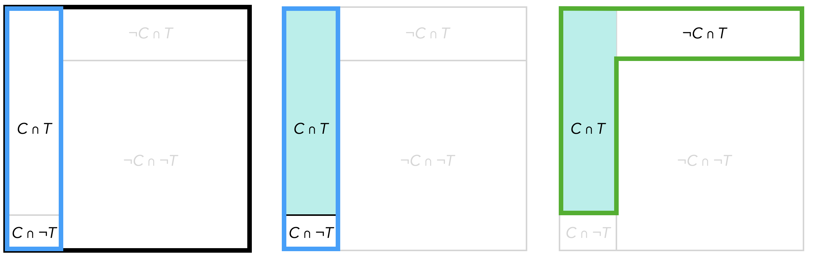

# Stochastik

> **Ziele**  
>  
> + Sie wissen um die Bedeutung des Modellierens bei stochastischen Situationen.  
> + Sie kennen verschiedene Möglichkeiten, stochastische Begriffe oder Verfahren zu visualisieren, insbesondere zu allgemeinen stochastischen Vorgängen (z. B. Zufallsexperimente), zur Kombinatorik und zu bedingten Wahrscheinlichkeiten.
>  
> **Material**
>
> + Folien zum Kapitel 12 ([pdf](files/Stoffdidaktik2024-12-Stochastik.pdf), [Keynote](files/Stoffdidaktik2024-12-Stochastik.key))
> + Virtuelles Arbeitsmittel zum Boxplot ([html](files/Stoffdidaktik2024-12-Boxplot.html), [Cinderella](files/Stoffdidaktik2024-12-Boxplot.cdy))
>
> **Literaturempfehlungen**
>
> - @Kruger2015: *Didaktik der Stochastik in der Sekundarstufe I*
> - @Tietze:2002: *Mathematikunterricht in der Sekundarstufe II. Band 3: Didaktik der Stochastik*


## Stochastische Vorgänge

### Modellierungsstruktur

Grundsätzlich ist es Aufgabe der Stochastik, reale Prozesse zu modellieren, um diese mit mathematischen Mitteln, also einem ***theoretischen Modell***, greifbar (und bearbeitbar) zu machen. Dazu ist es normalerweise notwendig, die ***reale Situation*** erst einmal zu vereinfachen und in ein ***Realmodell*** zu überführen (siehe Abbildung \@ref(fig:Modelle)). Dieses Vorgehen ist nicht spezifisch für die Stochastik -- jedoch ist der Zwischenschritt des Realmodells hier aufgrund der vielfältigen Modellierungsmöglichkeiten von besonderer Bedeutung. 

(ref:citeModelle) Modellierungsstruktur in der Stochastik [@Kruger2015 13]

```{r Modelle, echo=FALSE, fig.cap="(ref:citeModelle)", fig.align='center', out.width='75%'}
knitr::include_graphics("pictures/12-Modelle.png")
```

Aufbauend auf diese Struktur [die »nicht als expliziter Gegenstand des Stochastikunterrichts aufzufassen« ist, @Kruger2015 13] können Sie Ihre Diskussionen im Unterricht leiten und Schwierigkeiten der Schülerinnen und Schüler besser einordnen, z. B.:

* Wenn ein Würfel geworfen wird (reale Situation) und man die Wahrscheinlichkeit für eine Augenzahl angibt (theoretisches Modell), geht man davon aus, dass der Würfel aus sechs identischen Seiten besteht und in sich homogen ist (Realmodell). Mögliche Fragen, die auf eine solche Denkweise hinarbeiten, könnten sein: *Welche Annahmen triffst du? Welche Eigenschaften muss der Würfel haben, damit du so rechnen darfst?*

* Wenn erstmals *Zufallsgeräte* (übrigens auch ein Begriff auf der Ebene der Realmodelle) genutzt werden, muss eine Untergeneralisierung vermieden werden, es sollten also frühzeitig auch nicht-Laplace-Geräte eingesetzt werden, wie Reißzwecken, Quader, sogenannte Riemer-Würfel [@Riemer1988] oder auch *Würfel-Schweine* [@dewiki:214496187].

* Wenn eine Schülerin oder ein Schüler nicht in der Lage ist, für das Ziehen einer Herz-Karte aus einem Skatblatt die Wahrscheinlichkeit anzugeben, sollten Sie als Lehrkraft herausfinden, auf welcher Ebene Schwierigkeiten bestehen. Wird die reale Situation nicht verstanden (weil z. B. die Spielkartenfarben oder der Begriff *Skatblatt* unbekannt sind)? Bestehen Schwierigkeiten im Aufstellen eines Realmodells (dass also das Ziehen jeder Karte mit derselben Wahrscheinlichkeit verbunden ist und dafür die Anzahl der relevanten Karten bestimmt werden muss)? Oder sind Defizite in der Theorie verortet (weil etwa nicht die Laplace-Formel für die Berechnung der Wahrscheinlichkeit angewandt werden kann oder gar Schwierigkeiten bei der Division bestehen)?

### Prozessbetrachtung

Zur Unterstützung der Schülerinnen und Schüler in der Beschreibung stochastischer Vorgänge schlagen @Kruger2015 [{14 f.}] die Nutzung einer **Prozessbetrachtung** vor (siehe Abbildung \@ref(fig:Prozessbetrachtung)). 

(ref:citeProzessbetrachtung) Vorgangsbetrachtung nach @Kruger2015 [16]

```{r Prozessbetrachtung, echo=FALSE, fig.cap="(ref:citeProzessbetrachtung)", fig.align='center', out.width='75%'}
knitr::include_graphics("pictures/12-Prozessbetrachtung.png")
```


Es handelt sich hierbei um eine schematische Darstellung, wobei vier wesentliche Fragen relevant sind [@Kruger2015 15]:

1. »Welcher Vorgang läuft mit welchen Objekten oder Personen ab?« 
2. »Welches Merkmal interessiert mich? Wie kann ich das Merkmal erfassen?« 
3. »Welche Ergebnisse sind möglich?«
4. »Welche Bedingungen beeinflussen den Vorgang?«


Das Schema und die Leitfragen können im tätigkeitstheoretischen Sinne als *Orientierungshilfe* aufgefasst werden. Ein solches Vorgehen ist dabei sowohl für Fragen der Wahrscheinlichkeitsrechnung als auch für die Beschreibung von Statistiken möglich, womit auch beides als Teildisziplinen der Stochastik sichtbar werden kann. Abbildung \@ref(fig:Prozesse) zeigt exemplarisch zwei derartige Prozessbetrachtungen. 

```{r Prozesse, echo=FALSE, fig.cap="Prozessbetrachtungen für zwei stochastische Vorgänge", fig.align='center', out.width='95%'}
knitr::include_graphics("pictures/12-Prozesse.png")
```


## Kombinatorik

Eine Herausforderung kombinatorischer Fragestellungen besteht für Schülerinnen und Schüler oftmals in der korrekten Zuordnung zwischen kombinatorischer Situation und dem entsprechenden mathematischen Modell. Bei fehlendem Verständnis kann es daher in der Unterrichtsrealität schnell zum Raten kommen, welches der vier Modelle aus dem Tafelwerk gewählt wird (vgl. Tabelle \@ref(tab:kombinatorik-tafelwerk)).

[]()  | mit Wiederholung | ohne Wiederholung 
----|:----: | :----: 
**Variation** mit Beachtung der Reihenfolge | $n^k$ | $\frac{n!}{(n-k)!}$
**Kombination** ohne Beachtung der Reihenfolge | $\binom{n+k-1}{k} = \frac{(n+k-1)!}{k!(n-1)!}$ | $\binom{n}{k}=\frac{n!}{k!(n-k)!}$

Table: (\#tab:kombinatorik-tafelwerk) Typische Darstellung von Kombinatorik-Modellen in Tafelwerken


Es soll hier nicht diskutiert werden, wie die entsprechenden Formeln begründet werden können oder in welcher Reihenfolge sich welche Einführung anbietet. Vielmehr soll überlegt werden, welche Unterstützungsmöglichkeiten Schülerinnen und Schülern geboten werden können, um verständnisfördernd Situationen den entsprechenden mathematischen Modellen zuordnen zu können. Im Prinzip sind diese Unterstützungsmöglichkeiten selbst wieder Modelle als »Brücke zwischen einer stochastischen Realsituation und dem formalen Modell« [@Tietze:2002 197]. 

Zunächst gilt in allen vier Fällen: Aus einer Gesamtheit von $n$ Objekten werden (unter bestimmten Voraussetzungen) $k$ Objekte ausgewählt und (unter bestimmten Voraussetzungen) auf Plätze verteilt. Die Voraussetzung der Auswahl bestimmt, ob es sich um einen Vorgang mit oder ohne Wiederholung handelt. Die Voraussetzung der Verteilung ist mit oder ohne Beachtung der Reihenfolge.

Die Dichotomie **»mit Beachtung der Reihenfolge« -- »ohne Beachtung der Reihenfolge«** kann auch über die Frage *»Ist es relevant, ob ich im Nachhein meine Objekte umsortiere oder nicht?«* betrachtet werden. Eine Repräsentation sollte diese Relevanz der Reihenfolge unterstützen. Abbildung \@ref(fig:Reihenfolge) zeigt einen entsprechenden Vorschlag. 

```{r Reihenfolge, echo=FALSE, fig.cap="Repräsentation für Auswahl mit (links) und ohne (rechts) Beachtung der Reihenfolge", fig.align='center', out.width='75%'}
knitr::include_graphics("pictures/12-Reihenfolge.png")
```


Die Dichotomie **»mit Zurücklegen« -- »ohne Zurücklegen«** kann alternativ auch als **»mit Wiederholung« -- »ohne Wiederholung«** aufgefasst werden. Darf nicht wiederholt werden, ergibt sich schnell, dass $n\geq k$ gelten muss, da sonst nicht genügend Objekte vorhanden sind, aus denen gewählt wird. Die wählbaren Objekte können also als Ansammlung in einem großen Topf aufgefasst werden, aus dem sie jeweils einmalig gezogen werden können. Bei Wiederholung kann einerseits die Auffassung bestehen, dass die Objekte zurückgelegt werden dürfen (z. B. beim Ziehen bestimmter farbiger Kugeln), andererseits dass das Objekt hinreichend oft verfügbar ist (wenn z. B. Früchte für einen Obstsalat ausgewählt werden oder wenn bei einem Zahlenschloss jeweils die Ziffern 0 bis 9 zur Verfügung stehen). Abbildung \@ref(fig:Wiederholung) macht einen Vorschlag, wie dies allgemein repräsentiert werden kann.

```{r Wiederholung, echo=FALSE, fig.cap="Repräsentation für Auswahl ohne (links) und mit (rechts) Wiederholen/Zurücklegen", fig.align='center', out.width='75%'}
knitr::include_graphics("pictures/12-Wiederholung.png")
```

Daraus ergeben sich nun die vier Optionen, dargestellt als Tabelle in Abbildung \@ref(fig:Kombinatorik).

```{r Kombinatorik, echo=FALSE, fig.cap="Tabelle zur Variation/Kombination mit unterstützenden Repräsentationen", fig.align='center', out.width='95%'}
knitr::include_graphics("pictures/12-Kombinatorik.png")
```

Diese Repräsentation kann nun unterstützen, Realsituationen zu abstrahieren und dann dem entsprechenden mathematischen Modell zuzuordnen.

## Boxplot

Da beim Erstellen eines Boxplots nur mit absoluten Häufigkeiten einer geordneten Messreihe gearbeitet werden muss, bietet sich eine Behandlung auch schon in jüngeren Klassenstufen an. Hierbei treten die Begriffe **Median** und **Spannweite** sowie **oberes und unteres Quartil** auf. 

@Kruger2015 [123] empfehlen in der Einführung von Boxplots, zunächst auf die Behandlung von Ausreißern zu verzichten und parallel zum Boxplot die Daten als Punktdiagramm darzustellen (siehe Abbildung \@ref(fig:Boxplot)).

(ref:citeBoxplot) Boxplot mit Punktdiagramm [@Kruger2015 123]

```{r Boxplot, echo=FALSE, fig.cap="(ref:citeBoxplot)", fig.align='center', out.width='75%'}
knitr::include_graphics("pictures/12-Boxplot.png")
```


Abbildung \@ref(fig:ScreenshotBoxplot) zeigt den Screenshot eines [virtuellen Arbeitsmittels](files/Stoffdidaktik2024-12-Boxplot.html) zur Erkundung von Zusammenhängen am Boxplot, das im Rahmen einer Masterarbeit an der Universität Potsdam entstanden ist [@Korn2023].

```{r ScreenshotBoxplot, echo=FALSE, fig.cap="Screenshot des virtuellen Arbeitsmittels zum Boxplot", fig.align='center', out.width='75%'}
knitr::include_graphics("pictures/12-ScreenshotBoxplot.png")
```

Auch bei diesem Arbeitsmittel wird der Boxplot abhängig von der Lage der variierbaren Punkte automatisiert dargestellt. Über weitere Konfigurationen wie das Einblenden des Datensatzes oder das Ausblenden der Daten selbst können vielfältige Aufgaben bearbeitet werden [vgl. @Korn2023]:

* *Verändere den Datensatz so, dass*
  - *die Box kleiner wird,*
  - *die linke Antenne ganz lang und die rechte Antenne ganz kurz wird,*
  - *die rechte Hälfte der Box größer wird, aber der Median gleich bleibt.*
* *Erstelle einen eigenen Datensatz, blende ihn aus und lass deinen Partner bzw. deine Partnerin einen passenden Datensatz mit mindestens neun Werten finden, der denselben Boxplot produziert.*


## Bedingte Wahrscheinlichkeiten

Bei der Betrachtung von Situationen, in denen bedingte Wahrscheinlichkeiten eine Rolle spielen, haben Schülerinnen und Schüler (und nicht nur die) oftmals die Schwierigkeit, die verschiedenen Bedingungen auseinanderzuhalten, weshalb fehlerhafte Schlüsse gezogen werden [vgl. @Binder2020]. 

Ist beispielsweise bekannt, dass ein Corona-Test mit 90%-iger Wahrscheinlichkeit eine Person, die an Corona erkrankt ist, auch positiv testet und mit 95%-iger Wahrscheinlichkeit eine Person, die nicht an Corona erkrankt ist, auch negativ testet, so stellt sich die Frage, wie hoch die Wahrscheinlichkeit ist, dass man tatsächlich an Corona erkrankt ist, wenn der Test positiv ausfällt. Um diese Frage zu beantworten, ist es weiterhin noch nötig zu wissen (oder zu schätzen), wie hoch der Anteil tatsöchlich erkrankter Personen in der Gesamtbevölkerung ist. Geht man von einem Anteil von 1% aus, so stellt Abbildung \@ref(fig:Vierfeld) eine (nicht maßstäbliche) Vierfeldertafel dieser Situationen dar.

```{r Vierfeld, echo=FALSE, fig.cap="Vierfeldertafel für bedingte Wahrscheinlichkeiten", fig.align='center', out.width='50%'}
knitr::include_graphics("pictures/12-Vierfeld.png")
```


Es sind demnach bekannt:

\begin{align}
P(C) &= 0,\!01 \ \mathrm{(Prävalenz)}\\
P_C(T) &= 0,\!95 \ \mathrm{(Sensitivität)}\\
P_{\neg C}(\neg T) &= 0,\!99 \ \mathrm{(Spezifität)}
\end{align}

Grundsätzlich gilt als Definition für bedingte Wahrscheinlichkeiten: $$P_B(A) = \frac{P(A\cap B)}{P(B)}$$

Nach dem Satz von Bayes und dem Satz von der totalen Wahrscheinlichkeit gilt:
$$P_B(A) = \frac{P(A)\cdot P_A(B)}{P(B)} = \frac{P(A)\cdot P_A(B)}{P(A)\cdot P_A(B)+P(\neg A)\cdot P_{\neg A}(B)}$$
Hieran zeigt sich schon, dass Schülerinnen und Schüler Schwierigkeiten haben könnten, wenn sie nicht die hinter den Formeln liegenden Vorstellungen entwickeln, welche Wahrscheinlichkeiten jeweils aufeinander Bezug genommen werden. Geeignete Repräsentationen sollen nun helfen, die Zusammenhänge nachvollziehen zu können. Die **Vierfeldertafel** aus Abbildung \@ref(fig:Vierfeld) ist eine solche. Abbildung \@ref(fig:VierfeldEinzeln) zeigt, wie die Wahrscheinlichkeiten $P(C)$, $P_C(T)$ und $P_T(C)$ darin jeweils als Anteil einer Teilmengenbeziehung aufgefasst werden können.

```{r VierfeldEinzeln, echo=FALSE, fig.cap="Vierfeldertafeln zur Visualisierung der Wahrscheinlichkeiten $P(C)$, $P_C(T)$ und $P_T(C)$", fig.align='center', out.width='95%'}

```


Als Repräsentation ebenfalls verbreitet sind sogenannte **Doppelbäume**, siehe Abbildung \@ref(fig:Doppelbaum). Auch dort kann nachvollzogen werden, welche Beziehung jeweils betrachtet wird. 


```{r Doppelbaum, echo=FALSE, fig.cap="Doppelbaum für bedingte Wahrscheinlichkeiten", fig.align='center', out.width='75%'}
knitr::include_graphics("pictures/12-Doppelbaum.png")
```

Nach @Binder2020 bietet sich ebenfalls ein **Häufigkeitsnetz** an, siehe Abbildung \@ref(fig:Netz). Gegenüber den bisherigen Darstellungen können in diesem auch direkt die Schnittwahrscheinlichkeiten abgelesen werden. 


```{r Netz, echo=FALSE, fig.cap="Häufigkeitsnetz für bedingte Wahrscheinlichkeiten", fig.align='center', out.width='75%'}
knitr::include_graphics("pictures/12-Netz.png")
```

Als weitere Unterstützungsmöglichkeit, so hat es sich auch in empirischen Studien gezeigt [vgl. @Binder2020], bietet es sich an, mit **absoluten Häufigkeiten statt Wahrscheinlichkeiten** in den Repräsentationen zu arbeiten. Diese bieten Schülerinnen und Schülern eine bessere Zugänglichkeit zur Thematik und über Anteilsbetrachtungen können dann auch die Wahrscheinlichkeiten bestimmt werden.^[Mathematisch präzise müsste hier von *relativen Häufigkeiten* anstatt von *Wahrscheinlichkeiten* gesprochen werden.] Als (fiktive) Anzahl für die Grundgesamtheit bietet sich eine hohe Zehnerpotenz an, da so auch noch kleine Anteile mit sinnvollen (ggf. gerundeten) ganzen Zahlen bestimmt werden können.
